:scrollbar:
:data-uri:
:toc2:

= Red Hat Summit 2019: Next Gen Process Automation - using a process engine to orchestrate microservices

== Background

Microservice architectures are still hot. The idea of breaking up large monolith applications into smaller, focused, independently deployable services is attractive to a lot development groups. The increased adoption of cloud deployment platforms like OpenShift is an accelerator for the adoption of microservice architectures. The promise of microservice architectures is increased agility and reduced time to market.

However, the highly distributed nature of microservice architectures brings a lot of new challenges on the table, as the number and the complexity of the interactions between the microservices increases.

As far as communication patterns between microservices is concerned, we can distinguish between synchronous, request/reply communication (typically REST over HTTP) and asynchronous communication (messaging). The latter is used in event-driven architectures, where individual services consume and react on messages (events) sent by other services.

When we talk about the coordination of the communication flows between microservices, we can make a distinction between _orchestration_ and _choreography_.

In orchestration, an entity - this can be a centralized orchestration engine or an individual microservice - knows how and when to call other services to complete a business functionality. In a choreography, there is no such centralized control, every service knows what to do when invoked.

Microservice architecture thought leaders tend to promote the choreography model over the orchestration model. This is certainly the case for event-driven architectures. The perceived downside of orchestration is that it leads to tight coupling of the individual microservices, and is less flexible and less easy to change.

However real-life examples of large-scale microservice implementations have shown that pure choreography has its limits in terms of the ability to implement complex business functionality and to have visibility in the state of advancement of the business functionality.

Companies like Netflix and Uber have built, and open-sourced, specialized microservice orchestration engines (https://netflix.github.io/conductor[Netflix Conductor], https://github.com/uber/cadence[Uber Cadence]) to tackle the limits of the choreography model. https://zeebe.io[Camunda Zeebe] is another example.

This raises the question whether Red Hat technology - Red Hat Process Automation Manager (RHPAM) in particular - would be suited as an orchestration engine in an event driven microservices architecture. After all, the RHPAM engine is a sophisticated state machine, that can manage (persistent) state and state transitions. And BPMN2 - the process language used by RHPAM - is a rich DSL to describe state transitions. The current lab is a result of experimenting with that idea. Other requirements we set for this lab is the use of asynchronous communication patterns with Red Hat messaging technology, the use of cloud-native friendly runtimes (Spring Boot, Eclipse Vert.x) for service implementations and - of course - OpenShift as the runtime deployment platform.

== Prerequisites

*Tools*

You will need the following tools on your local machine. These are installed on the lab laptop:

* `oc` CLI tool, version 3.11
* `git`
* a text editor like Atom, or Sublime Text (optional).
* Ansible version 2.7.x
* SoapUI version 5.4.0

*Skills*

* OpenShift Basics, familiarity with `oc` CLI tool and the OpenShift web console
* Familiarity with Unix command line and terminal based text editors
* Java - although there is no coding in this lab

== Glossary

*RHPAM*: Red Hat Process Automation Manager. Open-source business automation platform that combines business process management (BPM), case management, business rules management, and resource planning. Current version 7.3.0.

*Process Server*: the execution server component of RHPAM.

*RHOAR*: Red Hat OpenShift Application Runtimes. A collection of runtimes, including WildFly Swarm, Spring Boot, Eclipse Vert.x and Node.js, designed to run on OpenShift. RHOAR provides a prescriptive approach to cloud-native development on OpenShift.

*AMQ Streams*: AMQ Streams is the Red Hat supported distribution of Apache Kafka, tailored specifically to run on OpenShift. Apache Kafka is a popular platform for streaming data delivery and processing.

== Goals and learning objectives

* Leverage RHPAM as a lightweight, embedded service orchestrator in an event driven microservice architecture.
* Gain insight in the behavior of the embedded process orchestrator with distributed tracing and application performance monitoring.

== Use case

The use case for this lab is a fictitious start-up, Acme, launching a taxi-hailing application, Acme Ride. The application is developed in a microservices architecture style, using a mix of synchronous and asynchronous communication patterns between the different services and components of the application.

In the context of this lab, we will focus on a tiny part of the overall solution, involving the following services:

* _Passenger service_: is the main gateway for the passenger mobile app. Through the mobile application a passenger can request and follow up on a ride.
* _Driver service_, acts as the main gateway for the driver mobile app. Through the mobile app, a driver can accept and manage a ride.
* _Dispatch service_: orchestrates the communication flow between the passenger, driver service and other services. Maintains the state of the ride entity (_single writer_ principle)

NOTE: The _Single Writer_ Principle is often used in microservice and event-driven architectures. The idea is that a single service is responsible for maintaining the state of an entity. Other services are kept up to date by subscribing to events that the Single Writer emits whenever the state of the entity changes. Subscribers typically maintain a read-only view of the entity.

== Architecture

The runtime architecture of the lab looks like:

image::images/presentation_runtime_topology.png[]

NOTE: In the picture above, replace EnMasse with AMQ Streams

In the lab, we'll implement the following message flows:

image::images/rhte-message-flow.png[]

Messages flowing through the systems fall in two categories: _Commands_, which tell the target system to do something - example: _AssignDriverCommand_, and _Events_, which inform tatget systems of a state change in the application - example: _DriverAssignedEvent_

Apache Kafka follows the _publish and subscribe_ messaging model: messages can be consumed by several consumers.

For an event-driven system as the one that is implemented in this lab, pubish/subscribe topics is generally what you want, as there are typically several services that are interested in a particular type of event. How to map event types to topics? This can vary from 1 topic for all event types to a separate topic per event type, or any variations in between. For the lab, we tried to segment per domain and per event class (event or command). So we ended up with 5 topics: _topic-ride-event_, _topic-driver-command_, _topic-driver-event_, _topic-passenger-command_ and _topic-passenger-event_. +
This means that message consumers need to filter on the specific event types that they are interested in an discard others.

== Lab Material

The lab material is hosted on GitHub, at the following URL:

`https://github.com/rht-summit2019-msa-orchestration`

The material consists of a number of git repositories:

* *dispatch-service* : the source code for the dispatch service.
* *driver-service* : the source code for the driver service.
* *passenger-service* : the source code for the passenger service.
* *dispatch-service-kjar* : a kjar that contains the process definition used in the dispatch service.
* *installation* : Ansible playbooks to install the different components on OpenShift and OpenShift resource files.
* *soapui* : SoapUI project to generate load in the system.

Create a folder on your workstation, and using `git`, clone the different projects into the folder.

----
$ cd ~
$ mkdir lab
$ cd lab
$ git clone https://github.com/rht-summit2019-msa-orchestration/installation.git
$ git clone https://github.com/rht-summit2019-msa-orchestration/dispatch-service.git
$ git clone https://github.com/rht-summit2019-msa-orchestration/driver-service.git
$ git clone https://github.com/rht-summit2019-msa-orchestration/passenger-service.git
$ git clone https://github.com/rht-summit2019-msa-orchestration/dispatch-service-kjar.git
----

NOTE: We highly encourage you to review the source code of the different services. However, please do not import the source code into an IDE during this lab (a text editor like Atom or Sublime is fine). Doing so will cause the IDE to try to build the code, and start downloading missing Maven dependencies. Considering the number of participants in this lab today, this will consume way too much bandwith.

== Code Walkthrough

=== Process Definition

The orchestration logic in the Dispatch service is implemented as a BPMN2 process. From a functional point of view, the orchestration is as follows:

* The Dispatch service receives a _RideRequestedEvent_ message from the _topic-ride-event_ topic.
* A _AssignDriverCommand_ is sent to the _topic-driver-command_ topic.
* The service waits for a _DriverAssignedEvent_ from the _topic-driver-event_ topic.
* If a _DriverAssignedEvent_ is not received within 5 minutes, the state of the Ride is set to _expired_. A _RideExpiredEvent_ is sent to the _topic-ride-event_ queue.
* As long as the ride did not start, the passenger can cancel the ride. The service waits on a _RideCanceledEvent_ from the _topic-ride-event_ topic, or a _RideStartedEvent_ from the _driver-event-topic_, whichever comes first.
* If a _RideCanceledEvent_ is received, the status of the ride is set to _canceled_. +
The passenger will have to pay a penalty (this part is not implemented)
* If a _RideStartedEvent_ is received, the status of the ride is set to
_started_ and the service waits for a _RideEndedEvent_.
* If a _RideEndedEvent_ is received, a _HandlePaymentCommand_ message is sent to the _topic-passenger-command_ topic. The status of the ride is set to _ended_.

Note that several other use cases are currently not implemented in the lab:

* The driver can cancel a ride
* The passenger can cancel a ride before the ride is assigned to a driver.

The process diagram looks like:

image::images/dispatch_process_2.png[]

* _Signal_ event nodes are used to model the fact that the process is waiting for a certain type of message. When the service receives a message, it finds the relevant process instance, and signals the process.
* Signal nodes are wait states, so at each signal the state of the process instance is saved in the database.
* The data model for the process is very simple: the process instance only keeps track of the _rideId_ for the ride Entity.
* The process uses two custom _WorkItemHandlers_.
** The _Assign Driver_ and _Handle Payment_ nodes use the _SendMessage_ WorkItemHandler. The implementation sends a message of specified type to the specified destination.
+
image::images/dispatch_process_send_message_2.png[]
+
image::images/dispatch_process_send_message_data_io.png[]
** The _Ride Request Expired_, _Driver Assigned_, _Ride_Started_, _Ride_Ended_ and _Passenger Canceled_ nodes uses the _UpdateRide_ WorkItemHandler, whose implementation updates the status of the Ride entity.
+
image::images/dispatch_process_update_ride_2.png[]
+
image::images/dispatch_process_update_ride_data_io.png[]

=== RHPAM engine embedded in Spring Boot application

Embedding the RHPAM proces engine in a Spring Boot application is extremely easy when using the provided Spring Boot starters. Adding the `jbpm-spring-boot-starter-basic` to the project dependencies will configure all the services required to ppower the process engine, including persistence and transaction management.

== OpenShift Environment

NOTE: TODO: Modify URLs, Lab codes and Screenshots to match Summit Guid Grabber

An Openshift environment is provided to you to deploy and run the lab's assets.

Details about the environment are obtained through the Red Hat Summit _GuidGrabber_.

. In a browser window, navigate to http://bit.ly/summit-guidgrabber.
+
image::images/guid_grabber_landing_page_summit.png[]
. From this page select the Lab Code : `TA39DD: Next-Gen Process Management: a microservices approach to business automation`
. Enter the *Activation Key*: `nextgenprocessmanagement`.
. Enter your email address.
. Click `Submit`.
. The resulting page will display your lab’s GUID and other useful information about your lab environment. +
+
image::images/guid_grabber_details_page_2.png[]
. When you are completely done with your lab environment, please click `Reset Workstation` so that you can move on to the next lab. If you fail to do this, you will be locked into the GUID from the previous lab.
+
NOTE: Clicking Reset Workstation will not stop or delete the lab environment.

To log in into the OpenShift console:

* Navigate to the URL `https://master00-<GUID>.generic.opentlc.com` - replace `<GUID>` with the lab GUID from the GuidGrabber tool.
* Login with username `user1` and the password mentioned in the GuidGrabber tool.
+
NOTE: verify if password can  be added to GuidGrabber
* Your OpenShift cluster uses self-signed certificates, so expect a security warning in the browser. Create a security exception and proceed.

To login with the `oc` client:

NOTE: The lab laptop has the `oc` client installed for both OpenShift 3.x and 4.x. This lab uses OpenShift 3.11. The `oc` client executable to use for this lab is `oc3`.

* In a terminal, enter the following command:
+
----
$ oc3 login https://master00-<GUID>.rhte.opentlc.com -u user1
----
* When prompted, accept to use insecure connections.
* When prompted, enter the password mentioned in the GuidGrabber tool.

== Provisioning on OpenShift

=== AMQ Streams

AMQ Streams uses the Operator model to deploy and manage Kafka (including Zookeeper) clusters. The AMQ Streams Cluster Operator works in tandem with a Kafka Custom Resource Definition, which describes the target Kafka cluster. When a Kafka resource is deployed into an OpenShift namespace monitored by the Cluster Operator, the Operator deploys a corresponding Kafka cluster. The cluster consists of a Zookeeper ensemble, the Kafka cluster and the Entity Operator, which provides operator-style topic management via KafkaTopic custom resources.

image::images/amq_streams_cluster_operator.png[]

Deploying Custom Resource Definitions on an OpenShift cluster requires cluster admin access. Cluster admin access is also required to give regular cluster users the necessary privileges to be able to create _Kafka_ and _KafkaTopic_ custom resources. You can gain cluster admin access in the OpenShift cluster for this lab by logging in with user `admin`.

. Log in into the OpenShift cluster with user `admin` - the password is the same as for `user1`.
+
----
$ oc3 login -u admin
----
. In a terminal, change directory to the folder where you cloned the `installation` project of the lab material.
. Change directory to the `ansible` directory, and run the `strimzi_operator.yml` playbook:
+
----
$ cd ansible
$ ansible-playbook playbooks/strimzi_operator.yml
----
+
The playbook creates the Kafka CRD's and deploys the AMQ Streams Cluster Operator.
. Expect the playbook to run to completion without failures. The playbook will wait until the Cluster Operator is up and running.
+
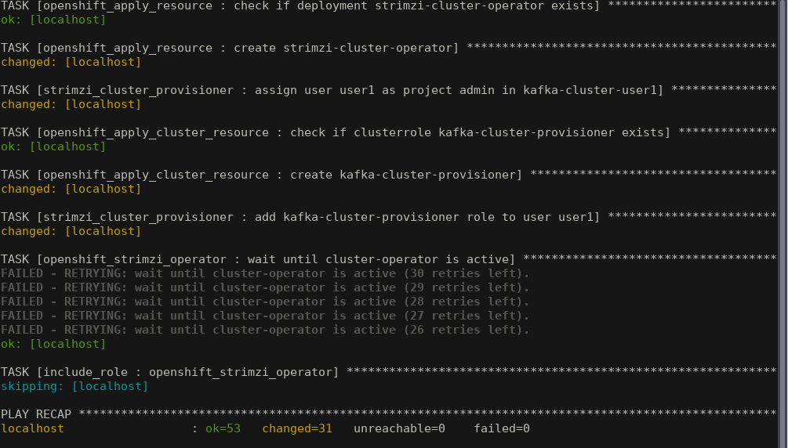
. Log out of the cluster and log back in again as `user1`:
+
----
$ oc3 logout
$ oc3 login -u user1
----
+
WARNING: This step is essential for the remainder of the lab. The Ansible playbooks that install the different components assume you are logged in into the cluster as `user1`.

In this lab, you leverage Ansible to deploy the _Kafka_ and _KafkaTopic_ resource definitions that describe the Kafka cluster and topics. The Kafka cluster consists of a Zookeeper ensemble of 3 nodes, and a Kafka cluster of 3 broker nodes.

. Make sure you are logged in with the `oc` client into your OpenShift environment.
. In a terminal, change directory to the folder where you cloned the `installation` project of the lab material.
. Change directory to the `ansible` directory, and run the `kafka_cluster.yml` playbook:
+
----
$ cd ansible
$ ansible-playbook playbooks/kafka_cluster.yml
----
+
The playbook deploys the Kafka resource for your Kafka cluster.
. Expect the playbook to run to completion without failures. The playbook will wait until the Topic Operator is up and running.
+
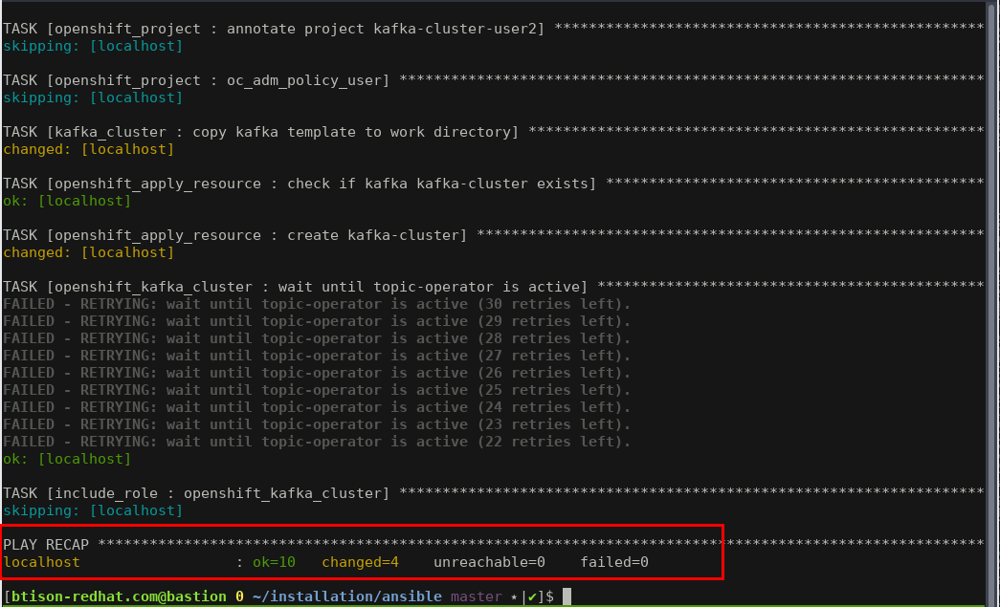
. In the case of an unexpected failure, try to find the root cause, and fix it. Run the playbook again. The playbook is idempotent, so it can be run several times if needed.
. Run the `kafka_topics.yml` playbook. This playbook installs KafkaTopic resources, based on which the Topic Operator creates the topics in the Kafka cluster.
+
----
$ ansible-playbook playbooks/kafka_topics.yml
----
. Expect the playbook to run to completion without failures.
+
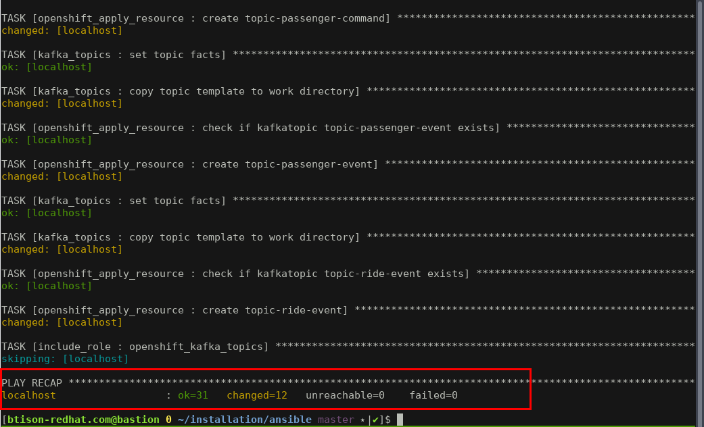
. Take a moment to review the installation.
* The Kafka cluster is deployed in a project `kafka-cluster-user1`. In the OpenShift console, log in as your user, and navigate to the project where the Kafka cluster is deployed. Expect to see the following:
+
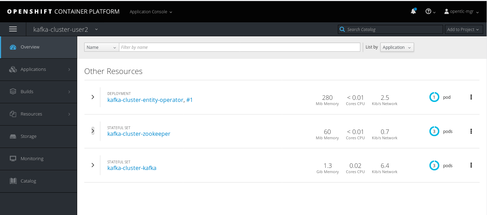
+
* *kafka-cluster-zookeeper* : Zookeeper ensemble consisting of 3 pods.
* *kafka-cluster-kafka*: Kafka broker cluster, consistsing of 3 broker pods.
* *kafka-cluster-entity-operator*: runs the Topic Operator, which watches KafkaTopic resources and manages Kafka topics on the cluster.
* If you want to review the Kafka cluster resource, you can get the yaml representation with `oc`:
+
----
$ export KAFKA_CLUSTER_PRJ=kafka-cluster-user1
$ oc3 project $KAFKA_CLUSTER_PRJ
$ oc3 get kafka kafka-cluster -o yaml
----
+
The Kafka cluster resource descriptor is very detailed. It basically consists of three sections: `zookeeper`, `kafka` and `entityOperator`. +
The `replicas` settings in the `kafka` sections determines the number of brokers in the kafka cluster. The `config` section sets configuration settings for the Kafka cluster, like the replication factor for the topic offsets.
+
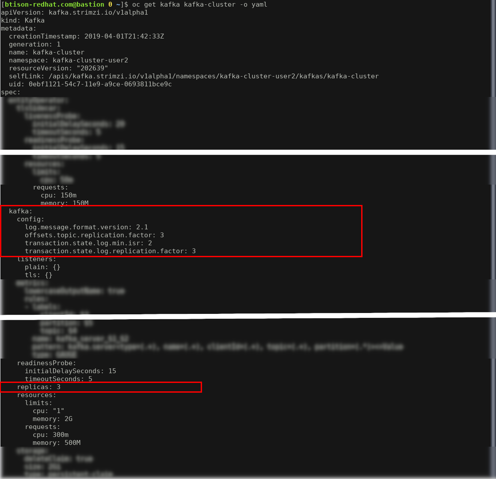
* To review the topics created on the cluster:
+
----
$ oc3 get kafkatopic
----
+
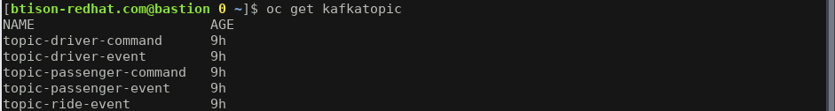
* To review the details of a topic:
+
----
$ oc3 get kafkatopic topic-driver-command -o yaml
----
+
image::images/kafka_topic_details.png[]
+
Note that the topic is configured with 2 replicas and 15 partitions.

=== Tools

Before we can start deploying the services that make up the Acme Ride application, we need to install some tools:

* Gogs: a lightweight Git server written in Go.
* Jenkins: the ubiquitous continuous integration server
* pgAdmin4: an open source web based administration and development platform for PostgreSQL

Just as with the Kafka cluster, you use Ansible playbooks to install these tools on OpenShift.

==== Gogs installation

The Ansible playbook installs the Gogs server, including creating the admin user (`gogsadmin/admin123`), developer user (`developer/developer123`) and organization (`acme`).

. Make sure you are logged in with the `oc` client into your OpenShift environment.
. In a terminal, change directory to the folder where you cloned the `installation` project of the lab material.
. Change directory to the `ansible` folder. Run the `gogs.yml` playbook.
+
----
$ cd ansible
$ ansible-playbook playbooks/gogs.yml
----
. Expect the playbook to run to completion without failures.
+
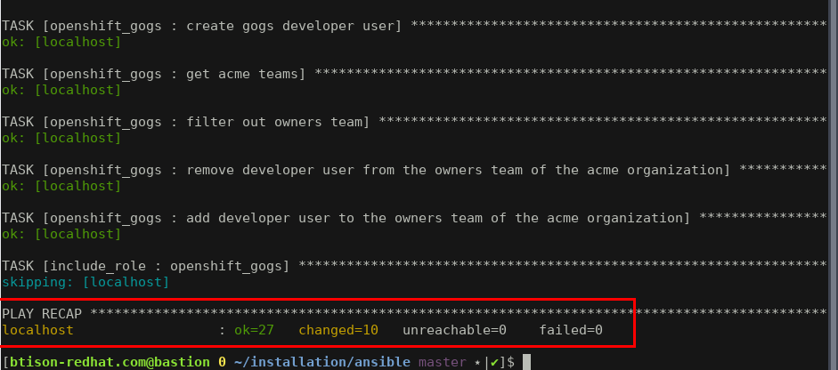
. Gogs is deployed in the `ride-msa-tools-user1` project. +
Get the URL for the `gogs` route:
+
----
$ export TOOLS_PRJ=ride-msa-tools-user1
$ echo "http://$(oc3 get route gogs -o jsonpath='{.spec.host}' -n $TOOLS_PRJ)"
----
. In a web browser window, navigate to the gogs URL. Expect to see the Gogs landing page.
+
image::images/gogs_landing_page.png[]
. Sign in as user `developer`, password `developer123`.

==== pgAdmin4 installation

We use an image from https://www.crunchydata.com[CrunchyData], a US based company offering services around enterprise deployments of PostgreSQL.

. Make sure you are logged in with the `oc` client into your OpenShift environment.
. In a terminal, change directory to the folder where you cloned the `installation` project of the lab material.
. Change directory to the `ansible` folder. Run the `pgadmin4.yml` playbook.
+
----
$ cd ansible
$ ansible-playbook playbooks/pgadmin4.yml
----
. Expect the playbook to run to completion without failures.
. pgAdmin4 is deployed in the `ride-msa-tools-user1` project. +
Get the URL for the `pgadmin4` route:
+
----
$ echo "http://$(oc3 get route pgadmin4 -o jsonpath='{.spec.host}' -n $TOOLS_PRJ)"
----
. In a browser window, navigate to the URL of the pgAdmin4 route. Login with `admin@example.com/admin123`. Expect to see the landing page of pgAdmin4.
+
image::images/pgadmin4_landing_page.png[]

==== Jenkins installation

Jenkins on OpenShift uses slave build pods to execute the different  steps of a build pipeline. These build pods are spawned on demand, and destroyed after the build is finished. +
The standard Jenkins instance on OpenShift is configured with two build pods, `nodejs` and `maven`. The second one has Maven installed, and can be used to build Maven projects. +
The default Maven build pod has no persistent storage for the local repository. So for every build, all the build and runtime dependencies need to be downloaded all over again. In this lab we are going to configure a custom Maven build pod which has a persistent volume mount to store the local Maven repo. This will drastically improve the build time - except for the first run, which still needs to download all required artifacts. +
Slave build pods can be configured as part of the build pipeline script, or with a configmap. This latter is used in this lab.

. Make sure you are logged in with the `oc` client into your OpenShift environment.
. In a terminal, change directory to the folder where you cloned the `installation` project of the lab material.
. Review the `openshift/jenkins/jenkins-maven-slave-configmap.yaml` configmap definition.
+
----
kind: List
metadata: {}
apiVersion: v1
items:
- kind: ConfigMap
  apiVersion: v1
  metadata:
    labels:
      role: jenkins-slave <1>
      app: jenkins
    name: jenkins-maven-slave <2>
  data:
    template1: |-
      <org.csanchez.jenkins.plugins.kubernetes.PodTemplate>
        <inheritFrom></inheritFrom>
        <name>maven-with-pvc</name>
        <namespace></namespace>
        <privileged>false</privileged>
        <alwaysPullImage>false</alwaysPullImage>
        <instanceCap>2147483647</instanceCap>
        <slaveConnectTimeout>100</slaveConnectTimeout>
        <idleMinutes>0</idleMinutes>
        <activeDeadlineSeconds>0</activeDeadlineSeconds>
        <label>maven-with-pvc</label>
        <serviceAccount>jenkins</serviceAccount>
        <nodeSelector></nodeSelector>
          <nodeUsageMode>NORMAL</nodeUsageMode>
          <customWorkspaceVolumeEnabled>false</customWorkspaceVolumeEnabled>
          <workspaceVolume class="org.csanchez.jenkins.plugins.kubernetes.volumes.workspace.EmptyDirWorkspaceVolume">
            <memory>false</memory>
          </workspaceVolume>
        <volumes> <3>
          <org.csanchez.jenkins.plugins.kubernetes.volumes.PersistentVolumeClaim>
            <mountPath>/home/jenkins/.m2/repository</mountPath>
            <claimName>jenkins-maven-slave-repository</claimName>
            <readOnly>false</readOnly>
          </org.csanchez.jenkins.plugins.kubernetes.volumes.PersistentVolumeClaim>
        </volumes>
        <containers>
          <org.csanchez.jenkins.plugins.kubernetes.ContainerTemplate>
            <name>jnlp</name> <4>
              <image>registry.redhat.io/openshift3/jenkins-agent-maven-35-rhel7:v3.11</image>
            <privileged>false</privileged>
            <alwaysPullImage>false</alwaysPullImage>
            <workingDir>/tmp</workingDir>
            <command></command>
            <args>${computer.jnlpmac} ${computer.name}</args>
            <ttyEnabled>false</ttyEnabled>
            <resourceRequestCpu>200m</resourceRequestCpu>
            <resourceRequestMemory>500Mi</resourceRequestMemory>
            <resourceLimitCpu>1000m</resourceLimitCpu>
            <resourceLimitMemory>1Gi</resourceLimitMemory>
            <envVars>
            </envVars>
            <ports/>
            <livenessProbe>
              <execArgs></execArgs>
              <timeoutSeconds>0</timeoutSeconds>
              <initialDelaySeconds>0</initialDelaySeconds>
              <failureThreshold>0</failureThreshold>
              <periodSeconds>0</periodSeconds>
              <successThreshold>0</successThreshold>
            </livenessProbe>
          </org.csanchez.jenkins.plugins.kubernetes.ContainerTemplate>
        </containers>
        <envVars/>
        <annotations/>
        <imagePullSecrets/>
        <nodeProperties/>
      </org.csanchez.jenkins.plugins.kubernetes.PodTemplate>
----
<1> The configmap has a label `jenkins-slave`. The Jenkins Kubernetes plugin watches for configmaps with this label, and when deteced, will configure a slave build pod according to the definition in the configmap.
<2> The `name` element in the `PodTemplate` definition is the name used to reference the build pod in build pipeline scripts.
<3> The `volume` element defines a persistent volume to be mounted at `/home/jenkins/.m2/repository`, which corresponds to the location of the local Maven repository in the build pod.
<4> The `image` element indicates which image to use for the slave pod. In this case we use the image of the regular Maven build pod.

. Change directory to the `ansible` folder. Run the Jenkins playbook.
+
----
$ cd ansible
$ ansible-playbook playbooks/jenkins.yml
----
. Expect the playbook to run to completion without failures.
. Wait until the Jenkins pod is up and running. You can verify this by executing the following `oc` command.
+
----
$ echo "$(oc3 get dc jenkins -o template --template='{{.status.readyReplicas}}' -n $TOOLS_PRJ)"
----
+
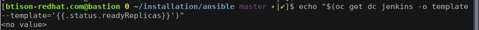
+
When the Jenkins pod is up and running, the command returns `1`:
+
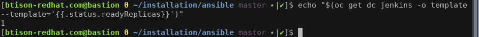
+
Alternatively, check the status of the Jenkins deployment in the OpenShift console. In the OpenShift web console, navigate to the `ride-msa-tools-user1` project. Expect to see a dark blue circle next to the Jenkins deployment as an indication that the Jenkins pod is up and running.
+
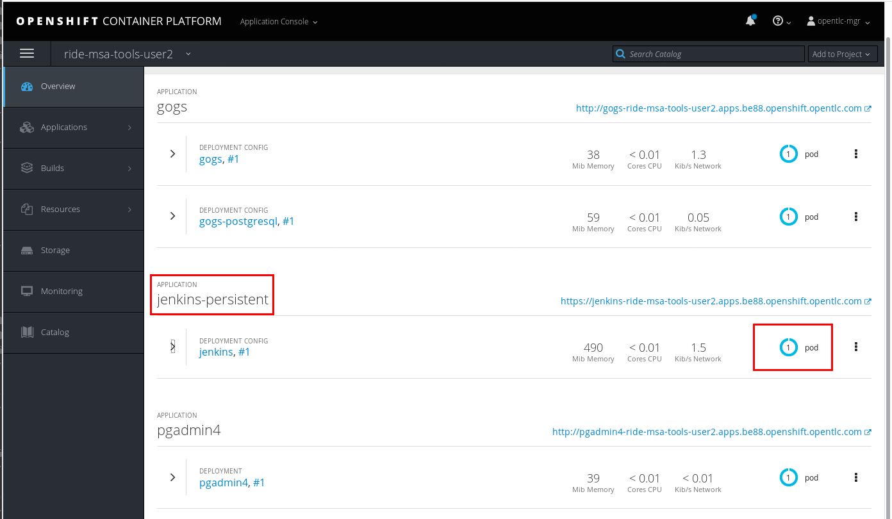

. Get the URL for the `jenkins` route:
+
----
$ echo "https://$(oc3 get route jenkins -o jsonpath='{.spec.host}' -n $TOOLS_PRJ")
----
. In a browser window, navigate to the  URL of the Jenkins route. Accept the security exception. Log in with your Openshift username and password. The first time you login, you need to authorize the Jenkins service account access to your Openshift profile. Click `Allow selected permissions`. You are redirected to the Jenkins landing page.
+
WARNING: In the OpenShift lab environment, which has limited resources, the login to jenkins might take a while and can eventually time out. If this is the case, you can skip the next step and safely continue with the remainder of the lab - the deployment of the application services.
+
image::images/jenkins_login_1.png[]
+
image::images/jenkins_login_2.png[]
+
image::images/jenkins_login_3.png[]
. Verify that the custom slave build pod template has been registered correctly in Jenkins.
* On the landing page, select _Manage Jenkins_.
* On the _Manage Jenkins_ page, select _Configure system_.
* Wait for the configuration page to open (this can sometimes take a while), and scroll down until you find the _Kubernetes_ section.
* Scroll further down until the _Images_ section, where you see a listing of the builder pod templates. There should be three Kubernetes Pod Templatestemplates, _maven_, _nodejs_ and _maven-with-pvc_.
* Verify that the _maven-with-pvc_ pod template is configured with a persistent volume claim:
+
image::images/jenkins_kubernetes_pod_template_1.png[]
+
image::images/jenkins_kubernetes_pod_template_2.png[]

=== Application Services

There are a couple of ways to deploy an application on OpenShift starting from source code.

* Binary build: the application is built locally with the appropriate build tool (Maven, Gradle, ...) and the resulting binary is injected into a OpenShift image using an OpenShift binary build. This is for example the way the Fabric8 Maven Plugin works. +
Very convenient for a developer for testing the application on OpenShift.

* Source-to-image (S2I): the application is build on OpenShift in the runtime image starting from the source code in a Git repository. Once the build is finished, the image is pushed to the OpenShift internal repository and deployed. +
This is an easy way to deploy an application from source code. However there are a number of drawbacks that make this method not really suitable for real world production usage:
** The resulting image contains all the build time dependencies of the application. In the case of for example a Maven build this can quickly add up.
** The S2I build is typically a minimal build. In the case of a Maven build the default Maven command is `mvn package -DskipTests`. Tests are not executed, there is no code quality analysis, etc..

* Build pipeline: a pipeline defines the build process which typically includes several stages for building, testing and delivering the application. The pipeline is executed on a build server. OpenShift provides tight integration with Jenkins, and allows to define build pipelines in an OpenShift buildconfig which will be executed on Jenkins.

In this lab we use Jenkins pipelines to build the application services from source code pulled from the Gogs git repository.

The pipeline used is similar for the different services and looks like:

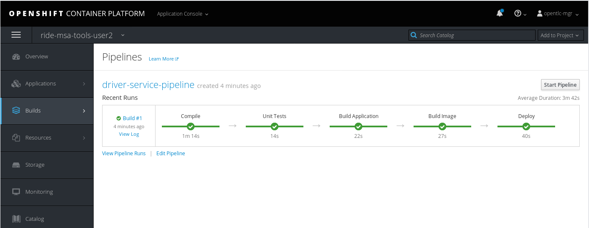

* Compile: The application source code is checked out from the Git repository, followed by a Maven compile step - `mvn clean compile`
* Unit Tests: Maven unit test execution - `mvn test`
* Build Application: builds the binary artifact for the application - `mvn package`
* Build Image: executes a binary Openshift build using the binary application artifact. The image is pushed to the OpenShift registry.
* Deploy: the image is tagged in the services namespace, causing a re(deploy) of the application.

The code of the pipeline:

----
          def git_url = "${GIT_URL}"
          def git_repo_app = "${GIT_REPO}"
          def version = ""
          def groupId = ""
          def artifactId = ""
          def namespace_jenkins = "${JENKINS_PROJECT}"
          def namespace_app = "${APP_PROJECT}"
          def app_build = "${APP_BUILD}"
          def app_imagestream = "${APP_IMAGESTREAM}"
          def app_name = "${APP_DC}"

          node ('maven-with-pvc') {
            stage ('Compile') {
              echo "Starting build"
              git url: "${git_url}/${git_repo_app}", branch: "master"
              def pom = readMavenPom file: 'pom.xml'
              version = pom.version
              groupId = pom.groupId
              artifactId = pom.artifactId
              echo "Building version ${version}"
              sh "mvn clean compile -Dcom.redhat.xpaas.repo.redhatga=true"
            }

            stage ('Unit Tests') {
              sh "mvn test -Dcom.redhat.xpaas.repo.redhatga=true"
            }

            stage ('Build Application') {
              sh "mvn package -DskipTests=true -Dcom.redhat.xpaas.repo.redhatga=true"
            }

            stage ('Build Image') {
              openshift.withCluster() { // Use "default" cluster or fallback to OpenShift cluster detection
                def bc = openshift.selector("bc", "${app_build}")
                def builds = bc.startBuild("--from-file=target/${artifactId}-${version}.jar")
                timeout (15) {
                  builds.watch {
                    if ( it.count() == 0 ) {
                      return false
                    }
                    // Print out the build's name and terminate the watch
                    echo "Detected new builds created by buildconfig: ${it.names()}"
                    return true
                  }
                  builds.untilEach(1) {
                    return it.object().status.phase == "Complete"
                  }
                }
              }
            }

            stage ('Deploy') {
              openshift.withCluster() {
                openshift.withProject( "${namespace_app}") {
                  openshift.tag("${namespace_jenkins}/${app_imagestream}:latest", "${namespace_app}/${app_imagestream}:latest")
                  def dc_app = openshift.selector("dc", "${app_name}")
                  timeout (5) {
                    dc_app.untilEach(1) {
                      return it.object().status.readyReplicas == 1
                    }
                  }
                }
              }
            }
          }
----

==== Push source code to Gogs

. In a browser window, navigate to the Gogs landing page. Log in with `developer/developer123`.
. Create a repository for the driver service source code.
* Click on the `+` link in the top right corner of the page, and select `New Repository`.
* In the `New Repository` page make sure to select `developer` as the repository owner.
+
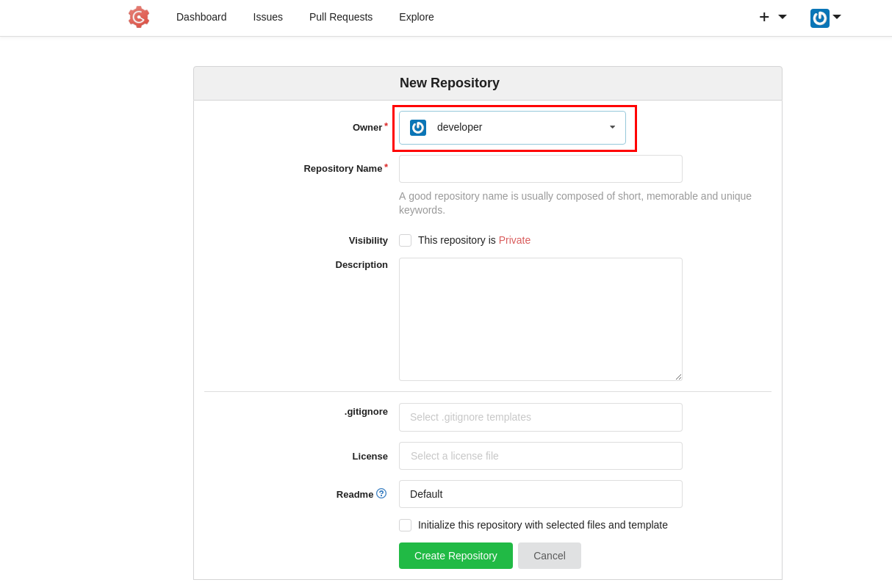
* Enter `driver-service` as repository name. Leave the other fields as is.
* Click `Create Repository`
* On the landing page of the newly created repository, copy the HTTP URL to the repository.
+
image::images/gogs_repository_link_developer.png[]
. Push the driver service source code to Gogs
* In a terminal window on your workstation, change directory to the directory where you cloned the driver service source code from GitHub.
* Add a new remote repository called `gogs` pointing to the repository on Gogs. Add the credentials for the developer user to the url of the remote. Push the source code.
+
----
$ git remote add gogs http://developer:developer123@<url of the driver service repository on gogs>
$ git checkout master
$ git push -u gogs master
----
. Repeat for the passenger service, dispatch service and dispatch-service-kjar source code. +
When done you should have four projects in the _developer_ dashboard in Gogs:
+
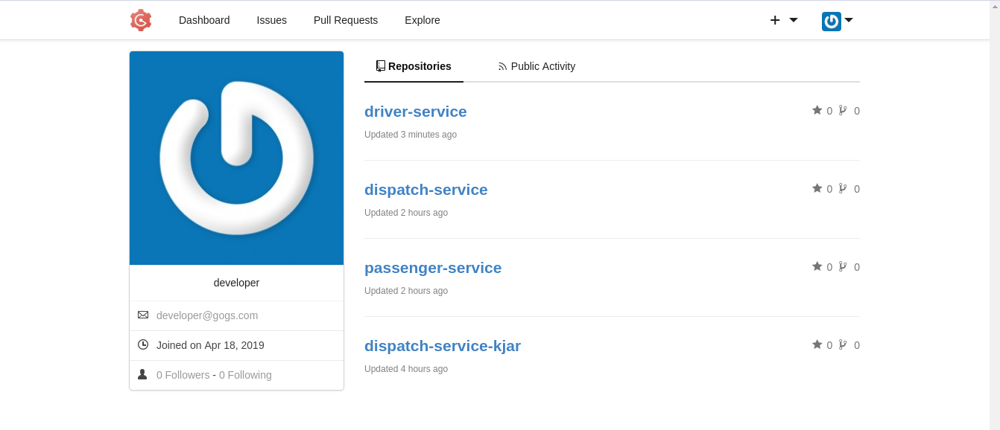

==== Driver service installation

In this lab, you use an Ansible playbook to install the different Openshift resources for the Driver service. The playbook installs:

* *driver-service-pipeline.yml*: the build pipeline for the driver service. The Jenkinsfile is embedded in the pipeline.
* *driver-service-binary.yaml*: defines the buildconfig used by the build pipeline to build the image for the service, and the corresponding imagestream.
* *driver-service-template.yaml*: defines the service and the deployment config for the driver service.
* The application configmap for the Driver service, containing environment specific properties, and the logging configmap, containing externalized logging configuration for the Driver service.

Feel free to review these resources. They are located in the `openshift/driver-service` folder of the `installation` project. The configmap template can be found in the `ansible/roles/openshift_driver_service/templates` folder.

. Make sure you are logged in with the `oc` client into your OpenShift environment.
. In a terminal, change directory to the folder where you cloned the `installation` project of the lab material.
. Change to the `ansible` directory, and run the `driver_service.yml` playbook.
+
----
$ cd ansible
$ ansible-playbook playbooks/driver_service.yml
----
. Expect the playbook to run to completion without failures.
. Review the installation:
* The build pipeline and the binary buildconfig for the driver service are created in the `ride-msa-tools-user1` project.
+
----
$ oc3 get bc -n $TOOLS_PRJ
----
+
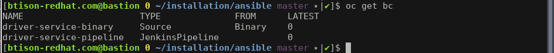
* The deploymentconfig and service for the Driver service are created in the `ride-msa-services-user1` project:
+
----
$ export SERVICES_PRJ=ride-msa-services-user1
$ oc3 project $SERVICES_PRJ
$ oc3 get dc
$ oc3 get services
----
+
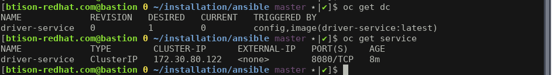
* The configmaps are created in the `ride-msa-services-user1` project:
+
----
$ oc3 get configmap
----
+
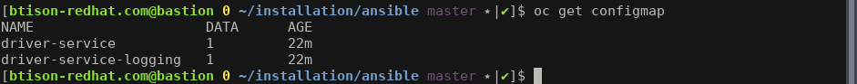
* The `driver-service` configmap has the connection details for the kafka cluster:
+
----
$ oc3 get configmap driver-service -o yaml
----
+
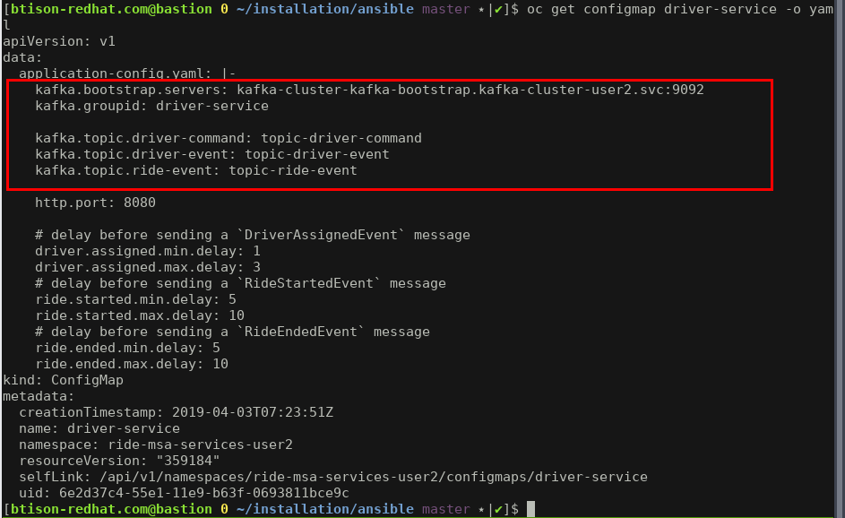

. Start the build pipeline for the driver service:
+
----
$ oc3 start-build driver-service-pipeline -n $TOOLS_PRJ
----
. Follow the progression of the build pipeline in the OpenShift console - In the OpenShift console, navigate to the _ride-msa-tools-user1_ project, and select _Builds->Pipelines_ from the side menu. +
Expect the pipeline to complete succesfully.
+
image::images/driver_service_build_pipeline.png[]
+
If the pipeline build fails, check the pipeline build logs to see what went wrong, and if needed fix the issue.
. Once the pipeline has executed, check that the driver service has deployed successfully in the _ride-msa-services-user1_ project.
+
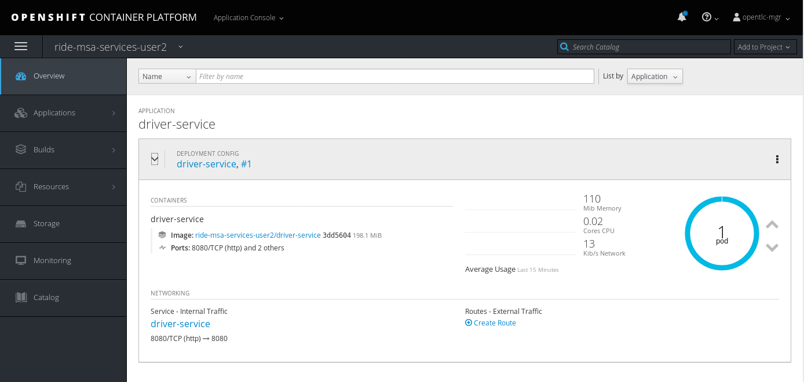
. In the OpenShift console, navigate to the driver service pod, and check the logs of the pod. Alternatively you can use `oc3 logs -f <name of the pod>`. +
Expect to see something like:
+
----
Starting the Java application using /opt/run-java/run-java.sh ...
exec java -Dapplication.configmap=driver-service -Dvertx.logger-delegate-factory-class-name=io.vertx.core.logging.SLF4JLogDelegateFactory -Dlogback.configurationFile=/app/logging/logback.xml -Xms63m -Xmx250m -XX:+UnlockExperimentalVMOptions -XX:+UseCGroupMemoryLimitForHeap -XX:+UseParallelOldGC -XX:MinHeapFreeRatio=10 -XX:MaxHeapFreeRatio=20 -XX:GCTimeRatio=4 -XX:AdaptiveSizePolicyWeight=90 -XX:MaxMetaspaceSize=100m -XX:ParallelGCThreads=1 -Djava.util.concurrent.ForkJoinPool.common.parallelism=1 -XX:CICompilerCount=2 -XX:+ExitOnOutOfMemoryError -cp . -jar /deployments/driver-service-1.0-SNAPSHOT.jar
2019-04-03 08:15:13.241  INFO   --- [ntloop-thread-2] o.a.k.clients.consumer.ConsumerConfig    : ConsumerConfig values:

...

2019-04-03 08:15:13.637  INFO   --- [ntloop-thread-3] o.a.kafka.common.utils.AppInfoParser     : Kafka version : 1.0.0
2019-04-03 08:15:13.637  INFO   --- [ntloop-thread-3] o.a.kafka.common.utils.AppInfoParser     : Kafka commitId : aaa7af6d4a11b29d
2019-04-03 08:15:13.656  INFO   --- [ntloop-thread-2] o.a.kafka.common.utils.AppInfoParser     : Kafka version : 1.0.0
2019-04-03 08:15:13.656  INFO   --- [ntloop-thread-2] o.a.kafka.common.utils.AppInfoParser     : Kafka commitId : aaa7af6d4a11b29d
2019-04-03 08:15:13.743  INFO   --- [ntloop-thread-0] c.acme.ride.driver.service.MainVerticle  : Verticles deployed successfully.
2019-04-03 08:15:13.743  INFO   --- [ntloop-thread-4] i.v.c.i.l.c.VertxIsolatedDeployer        : Succeeded in deploying verticle
2019-04-03 08:15:38.187  INFO   --- [nsumer-thread-0] o.a.k.c.c.internals.AbstractCoordinator  : [Consumer clientId=consumer-1, groupId=driver-service] Discovered coordinator kafka-cluster-kafka-0.kafka-cluster-kafka-brokers.kafka-cluster-user2.svc.cluster.local:9092 (id: 2147483647 rack: null)
2019-04-03 08:15:38.189  INFO   --- [nsumer-thread-0] o.a.k.c.c.internals.ConsumerCoordinator  : [Consumer clientId=consumer-1, groupId=driver-service] Revoking previously assigned partitions []
2019-04-03 08:15:38.190  INFO   --- [nsumer-thread-0] o.a.k.c.c.internals.AbstractCoordinator  : [Consumer clientId=consumer-1, groupId=driver-service] (Re-)joining group
2019-04-03 08:15:38.201  INFO   --- [nsumer-thread-0] o.a.k.c.c.internals.AbstractCoordinator  : [Consumer clientId=consumer-1, groupId=driver-service] Marking the coordinator kafka-cluster-kafka-0.kafka-cluster-kafka-brokers.kafka-cluster-user2.svc.cluster.local:9092 (id: 2147483647 rack: null) dead
2019-04-03 08:15:38.509  INFO   --- [nsumer-thread-0] o.a.k.c.c.internals.AbstractCoordinator  : [Consumer clientId=consumer-1, groupId=driver-service] Discovered coordinator kafka-cluster-kafka-0.kafka-cluster-kafka-brokers.kafka-cluster-user2.svc.cluster.local:9092 (id: 2147483647 rack: null)

...

2019-04-03 08:15:44.713  INFO   --- [nsumer-thread-0] o.a.k.c.c.internals.AbstractCoordinator  : [Consumer clientId=consumer-1, groupId=driver-service] (Re-)joining group
2019-04-03 08:15:47.799  INFO   --- [nsumer-thread-0] o.a.k.c.c.internals.AbstractCoordinator  : [Consumer clientId=consumer-1, groupId=driver-service] Successfully joined group with generation 1
2019-04-03 08:15:47.801  INFO   --- [nsumer-thread-0] o.a.k.c.c.internals.ConsumerCoordinator  : [Consumer clientId=consumer-1, groupId=driver-service] Setting newly assigned partitions [topic-driver-command-6, topic-driver-command-7, topic-driver-command-8, topic-driver-command-9, topic-driver-command-10, topic-driver-command-11, topic-driver-command-12, topic-driver-command-13, topic-driver-command-14, topic-driver-command-0, topic-driver-command-1, topic-driver-command-2, topic-driver-command-3, topic-driver-command-4, topic-driver-command-5]
----

==== Passenger service installation

The procedure is equivalent to the driver service.

. Make sure you are logged in with the `oc` client into your OpenShift environment.
. In a terminal, change directory to the folder where you cloned the `installation` project of the lab material.
. Change to the `ansible` directory, and run the `passenger_service.yml` playbook.
+
----
$ cd ansible
$ ansible-playbook playbooks/passenger_service.yml
----
. Expect the playbook to run to completion without failures.
. Review the installation:
* The build pipeline and the binary buildconfig for the Passenger service are created in the tools project.
+
----
$ oc3 get bc -n $TOOLS_PRJ
----
+
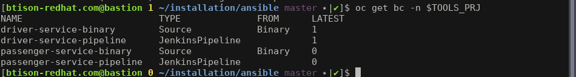
* The deploymentconfig and service for the Passenger service are created in the services project:
+
----
$ oc3 get dc -n $SERVICES_PRJ
$ oc3 get service -n $SERVICES_PRJ
----
+
image::images/passenger_service_dc.png[]
* The configmaps are created in the `ride-msa-services-user1` project:
+
----
$ oc3 get configmap -n $SERVICES_PRJ
----
+
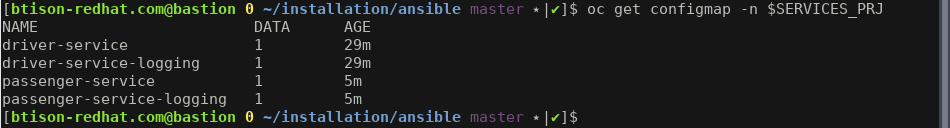
* The `passenger-service` configmap has the connection details for the kafka cluster:
+
----
$ oc3 get configmap passenger-service -o yaml -n $SERVICES_PRJ
----
+
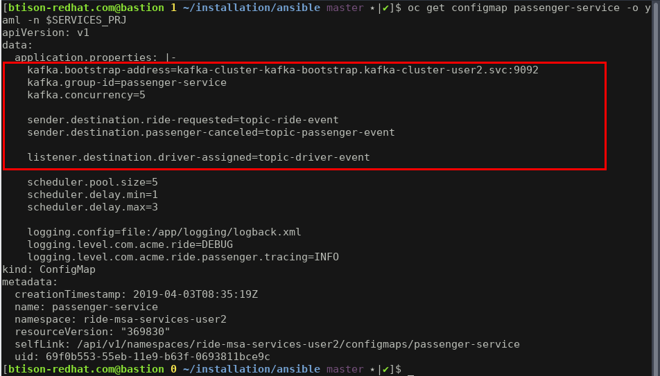

. Start the build pipeline for the passenger service:
+
----
$ oc3 start-build passenger-service-pipeline -n $TOOLS_PRJ
----
. Follow the progression of the build pipeline in the OpenShift console. Expect the pipeline to complete successfully. +
If the pipeline build fails, check the pipeline build logs to see what went wrong, and if needed fix the issue.
+
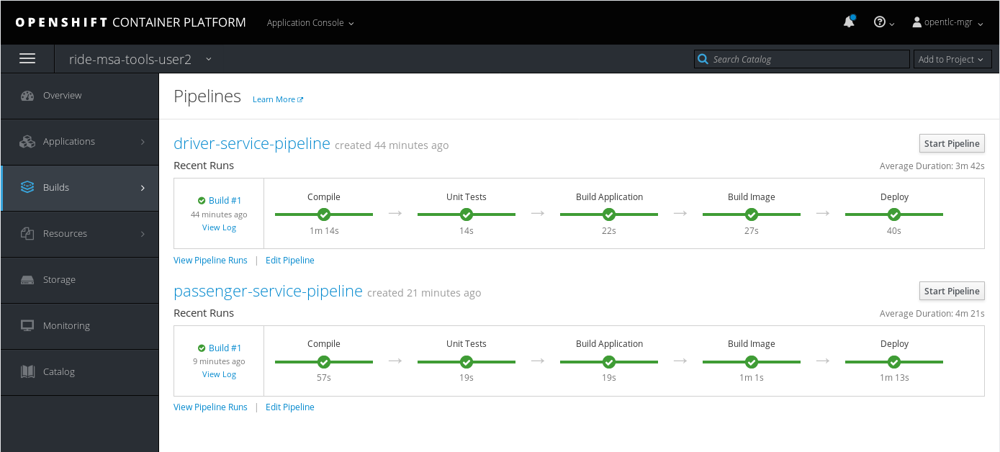
. Once the pipeline has executed, check that the passenger service has deployed successfully.
+
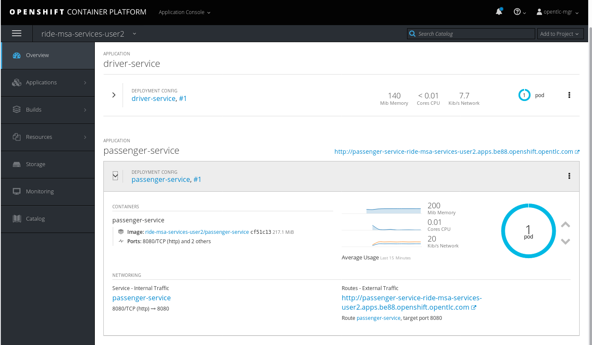
. In the OpenShift console, navigate to the passenger service pod, and check the logs of the pod. Alternatively you can use `oc3 logs -f <name of the pod>`. +
Expect to see something like:
+
----
Starting the Java application using /opt/run-java/run-java.sh ...
exec java -Xms63m -Xmx250m -XX:+UnlockExperimentalVMOptions -XX:+UseCGroupMemoryLimitForHeap -XX:+UseParallelOldGC -XX:MinHeapFreeRatio=10 -XX:MaxHeapFreeRatio=20 -XX:GCTimeRatio=4 -XX:AdaptiveSizePolicyWeight=90 -XX:MaxMetaspaceSize=100m -XX:ParallelGCThreads=1 -Djava.util.concurrent.ForkJoinPool.common.parallelism=1 -XX:CICompilerCount=2 -XX:+ExitOnOutOfMemoryError -cp . -jar /deployments/passenger-service-1.0-SNAPSHOT.jar
2019-04-03 10:09:41.997  INFO 1 --- [           main] trationDelegate$BeanPostProcessorChecker : Bean 'org.springframework.cloud.autoconfigure.ConfigurationPropertiesRebinderAutoConfiguration' of type [org.springframework.cloud.autoconfigure.ConfigurationPropertiesRebinderAutoConfiguration$$EnhancerBySpringCGLIB$$8052c8bc] is not eligible for getting processed by all BeanPostProcessors (for example: not eligible for auto-proxying)
  .   ____          _            __ _ _
 /\\ / ___'_ __ _ _(_)_ __  __ _ \ \ \ \
( ( )\___ | '_ | '_| | '_ \/ _` | \ \ \ \
 \\/  ___)| |_)| | | | | || (_| |  ) ) ) )
  '  |____| .__|_| |_|_| |_\__, | / / / /
 =========|_|==============|___/=/_/_/_/
 :: Spring Boot ::        (v2.1.3.RELEASE)

2019-04-03 10:09:43.078  INFO 1 --- [           main] b.c.PropertySourceBootstrapConfiguration : Located property source: CompositePropertySource {name='composite-configmap', propertySources=[ConfigMapPropertySource {name='configmap.passenger-service.ride-msa-services-user2'}]}
2019-04-03 10:09:43.080  INFO 1 --- [           main] b.c.PropertySourceBootstrapConfiguration : Located property source: SecretsPropertySource {name='secrets.passenger-service.ride-msa-services-user2'}
2019-04-03 10:09:43.580  INFO 1 --- [           main] c.a.r.p.PassengerServiceApplication      : The following profiles are active: kubernetes
2019-04-03 10:09:46.388  INFO 1 --- [           main] o.s.cloud.context.scope.GenericScope     : BeanFactory id=04d88a13-67ae-37d7-aa71-cb4e4f032837
2019-04-03 10:09:46.573  INFO 1 --- [           main] trationDelegate$BeanPostProcessorChecker : Bean 'org.springframework.kafka.annotation.KafkaBootstrapConfiguration' of type [org.springframework.kafka.annotation.KafkaBootstrapConfiguration$$EnhancerBySpringCGLIB$$37ead742] is not eligible for getting processed by all BeanPostProcessors (for example: not eligible for auto-proxying)
2019-04-03 10:09:46.687  INFO 1 --- [           main] trationDelegate$BeanPostProcessorChecker : Bean 'org.springframework.cloud.autoconfigure.ConfigurationPropertiesRebinderAutoConfiguration' of type [org.springframework.cloud.autoconfigure.ConfigurationPropertiesRebinderAutoConfiguration$$EnhancerBySpringCGLIB$$8052c8bc] is not eligible for getting processed by all BeanPostProcessors (for example: not eligible for auto-proxying)
2019-04-03 10:09:47.796  INFO 1 --- [           main] o.s.b.w.embedded.tomcat.TomcatWebServer  : Tomcat initialized with port(s): 8080 (http)
2019-04-03 10:09:47.976  INFO 1 --- [           main] o.a.coyote.http11.Http11NioProtocol      : Initializing ProtocolHandler ["http-nio-8080"]2019-04-03 10:09:47.991  INFO 1 --- [           main] o.apache.catalina.core.StandardService   : Starting service [Tomcat]
2019-04-03 10:09:47.992  INFO 1 --- [           main] org.apache.catalina.core.StandardEngine  : Starting Servlet engine: [Apache Tomcat/9.0.16]
2019-04-03 10:09:48.085  INFO 1 --- [           main] o.a.catalina.core.AprLifecycleListener   : The APR based Apache Tomcat Native library which allows optimal performance in production environments was not found on the java.library.path: [/usr/java/packages/lib/amd64:/usr/lib64:/lib64:/lib:/usr/lib]2019-04-03 10:09:48.584  INFO 1 --- [           main] o.a.c.c.C.[Tomcat].[localhost].[/]       : Initializing Spring embedded WebApplicationContext
2019-04-03 10:09:48.584  INFO 1 --- [           main] o.s.web.context.ContextLoader            : Root WebApplicationContext: initialization completed in 4992 ms
2019-04-03 10:09:51.278  INFO 1 --- [           main] org.apache.cxf.endpoint.ServerImpl       : Setting the server's publish address to be /
2019-04-03 10:09:52.578  INFO 1 --- [           main] o.a.k.clients.consumer.ConsumerConfig    : ConsumerConfig values:

...

2019-04-03 10:09:58.581  INFO 1 --- [ntainer#0-3-C-1] org.apache.kafka.clients.Metadata        : Cluster ID: nIsKvmg7TluR7fXYncaZjA
2019-04-03 10:09:58.581  INFO 1 --- [ntainer#0-3-C-1] o.a.k.c.c.internals.AbstractCoordinator  : [Consumer clientId=consumer-5, groupId=passenger-service] Discovered group coordinator kafka-cluster-kafka-0.kafka-cluster-kafka-brokers.kafka-cluster-user2.svc.cluster.local:9092 (id:
2147483647 rack: null)
2019-04-03 10:09:58.582  INFO 1 --- [ntainer#0-3-C-1] o.a.k.c.c.internals.ConsumerCoordinator  : [Consumer clientId=consumer-5, groupId=passenger-service] Revoking previously assigned partitions []
2019-04-03 10:09:58.582  INFO 1 --- [ntainer#0-3-C-1] o.s.k.l.KafkaMessageListenerContainer    : partitions revoked: []
2019-04-03 10:09:58.582  INFO 1 --- [ntainer#0-3-C-1] o.a.k.c.c.internals.AbstractCoordinator  : [Consumer clientId=consumer-5, groupId=passenger-service] (Re-)joining group
2019-04-03 10:09:58.584  INFO 1 --- [           main] o.a.kafka.common.utils.AppInfoParser     : Kafka version : 2.0.1
2019-04-03 10:09:58.584  INFO 1 --- [           main] o.a.kafka.common.utils.AppInfoParser     : Kafka commitId : fa14705e51bd2ce5
2019-04-03 10:09:58.584  INFO 1 --- [           main] o.s.s.c.ThreadPoolTaskScheduler          : Initializing ExecutorService
2019-04-03 10:09:58.677  INFO 1 --- [ntainer#0-4-C-1] org.apache.kafka.clients.Metadata        : Cluster ID: nIsKvmg7TluR7fXYncaZjA
2019-04-03 10:09:58.677  INFO 1 --- [ntainer#0-4-C-1] o.a.k.c.c.internals.AbstractCoordinator  : [Consumer clientId=consumer-6, groupId=passenger-service] Discovered group coordinator kafka-cluster-kafka-0.kafka-cluster-kafka-brokers.kafka-cluster-user2.svc.cluster.local:9092 (id:
2147483647 rack: null)
2019-04-03 10:09:58.678  INFO 1 --- [ntainer#0-4-C-1] o.a.k.c.c.internals.ConsumerCoordinator  : [Consumer clientId=consumer-6, groupId=passenger-service] Revoking previously assigned partitions[]
2019-04-03 10:09:58.679  INFO 1 --- [ntainer#0-4-C-1] o.s.k.l.KafkaMessageListenerContainer    : partitions revoked: []
2019-04-03 10:09:58.679  INFO 1 --- [ntainer#0-4-C-1] o.a.k.c.c.internals.AbstractCoordinator  : [Consumer clientId=consumer-6, groupId=passenger-service] (Re-)joining group
2019-04-03 10:09:58.683  INFO 1 --- [           main] o.a.coyote.http11.Http11NioProtocol      : Starting ProtocolHandler ["http-nio-8080"]
2019-04-03 10:09:58.795  INFO 1 --- [           main] o.s.b.w.embedded.tomcat.TomcatWebServer  : Tomcat started on port(s): 8080 (http) with context path ''
2019-04-03 10:09:58.797  INFO 1 --- [           main] c.a.r.p.PassengerServiceApplication      : Started PassengerServiceApplication in 26.119 seconds (JVM running for 28.202)
----

==== Dispatch service installation

The main difference between the dispatch service and the other services is the use of a PostgreSQL database for the embedded process engine.

The Ansible playbook for the Dispatch service will also take care of deploying and configuring the PostgreSQL database, including creating the schema for the proces engine.

Another aspect which is specific for the Dispatch service, is the fact that it depends on the Dispatch Process kjar, which contains the dispatch process definition. +
To keep things simple, we build the kjar as part of the Dispatch service build pipeline. In a more real-life setup, the kjar would have its own build pipeline which publishes the kjar into a repository, from where the dispatch service build pipeline would download it and add to its dependencies.

. Make sure you are logged in with the `oc` client into your OpenShift environment.
. In a terminal, change directory to the folder where you cloned the `installation` project of the lab material.
. Change to the `ansible` directory, and run the `dispatch_service.yml` playbook.
+
----
$ cd ansible
$ ansible-playbook playbooks/dispatch_service.yml
----
. Expect the playbook to run to completion without failures. Note that the playbook pauses until the PostgresQL database is up and running.
. Review the installation:
* A Postgresql pod is running in the services project:
+
----
$ oc3 get pods -n $SERVICES_PRJ
----
+
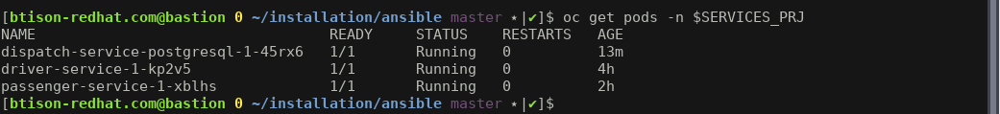
* The build pipeline and the binary buildconfig for the Dispatch service are created in the tools project.
+
----
$ oc3 get bc -n $TOOLS_PRJ
----
+
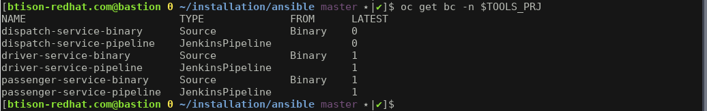
* The deploymentconfig and service for the Dispatch service and the database are created in the services project:
+
----
$ oc3 get dc -n $SERVICES_PRJ
$ oc3 get services -n $SERVICES_PRJ
----
+
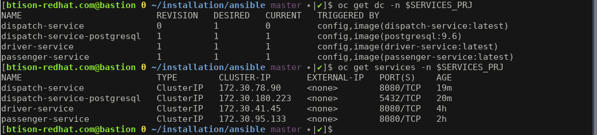
* The configmaps are created in the services project:
+
----
$ oc3 get configmap -n $SERVICES_PRJ
----
+
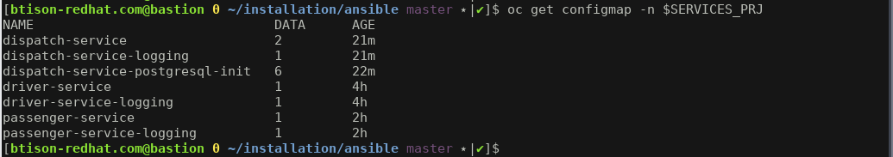
+
Note: the `dispatch-service-postgresql-init` configmap contains the ddl scripts for the database schema.
* The `dispatch-service` configmap has the connection details for the kafka cluster, settings for the database connection pool and the configuration for the Quartz scheduler (used by the process engine to schedule timers and jobs):
+
----
$ oc3 get configmap dispatch-service -o yaml -n $SERVICES_PRJ
----
+
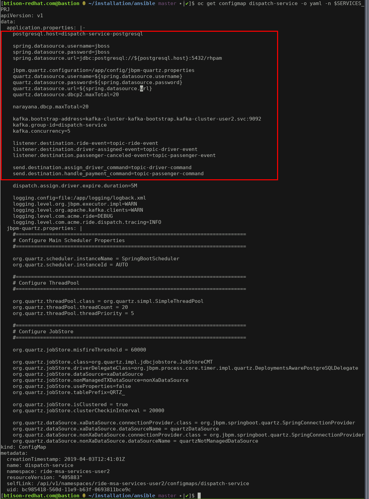

. Start the build pipeline for the dispatch service:
+
----
$ oc3 start-build dispatch-service-pipeline -n $TOOLS_PRJ
----
. Follow the progression of the build pipeline in the OpenShift console. Expect the pipeline to complete successfully. +
If the pipeline build fails, check the pipeline build logs to see what went wrong, and if needed fix the issue.
+
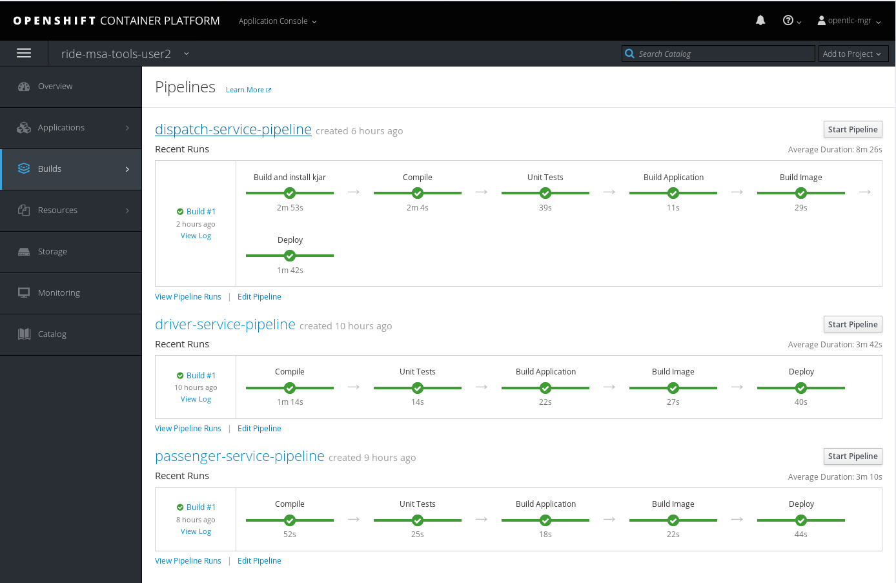
. Once the pipeline has executed, check that the dispatch service has deployed successfully.
+
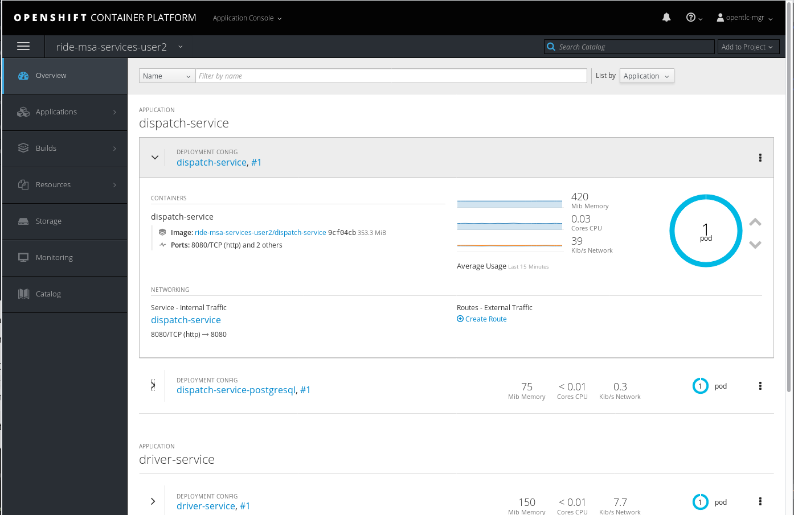
. In the OpenShift console, navigate to the dispatch service pod, and check the logs of the pod. Alternatively you can use `oc3 logs -f <name of the pod>`. +
Expect to see something like:
+
----
Starting the Java application using /opt/run-java/run-java.sh ...
exec java -Xms128m -Xmx512m -XX:+UnlockExperimentalVMOptions -XX:+UseCGroupMemoryLimitForHeap -XX:+UseParallelOldGC -XX:MinHeapFreeRatio=10 -XX:MaxHeapFreeRatio=20 -XX:GCTimeRatio=4 -XX:AdaptiveSizePolicyWeight=90 -XX:MaxMetaspaceSize=200m -XX:ParallelGCThreads=1 -Djava.util.concur
rent.ForkJoinPool.common.parallelism=1 -XX:CICompilerCount=2 -XX:+ExitOnOutOfMemoryError -cp . -jar /deployments/dispatch-service-1.0-SNAPSHOT.jar
2019-04-05 11:06:22.613  INFO 1 --- [           main] trationDelegate$BeanPostProcessorChecker : Bean 'org.springframework.cloud.autoconfigure.ConfigurationPropertiesRebinderAutoConfiguration' of type [org.springframework.cloud.autoconfigure.ConfigurationPropertiesRebinderAutoConfi
guration$$EnhancerBySpringCGLIB$$6d29b3a0] is not eligible for getting processed by all BeanPostProcessors (for example: not eligible for auto-proxying)

  .   ____          _            __ _ _
 /\\ / ___'_ __ _ _(_)_ __  __ _ \ \ \ \
( ( )\___ | '_ | '_| | '_ \/ _` | \ \ \ \
 \\/  ___)| |_)| | | | | || (_| |  ) ) ) )
  '  |____| .__|_| |_|_| |_\__, | / / / /
 =========|_|==============|___/=/_/_/_/
 :: Spring Boot ::        (v2.1.3.RELEASE)

2019-04-05 11:06:24.031  INFO 1 --- [           main] b.c.PropertySourceBootstrapConfiguration : Located property source: CompositePropertySource {name='composite-configmap', propertySources=[ConfigMapPropertySource {name='configmap.dispatch-service.ride-msa-services-user1'}]}
2019-04-05 11:06:24.033  INFO 1 --- [           main] b.c.PropertySourceBootstrapConfiguration : Located property source: SecretsPropertySource {name='secrets.dispatch-service.ride-msa-services-user1'}
2019-04-05 11:06:24.761  INFO 1 --- [           main] c.a.r.d.DispatchServiceApplication       : The following profiles are active: kubernetes
2019-04-05 11:06:32.030  INFO 1 --- [           main] o.s.cloud.context.scope.GenericScope     : BeanFactory id=661898ce-738a-3698-afcb-59c040e1435d
2019-04-05 11:06:32.126  INFO 1 --- [           main] trationDelegate$BeanPostProcessorChecker : Bean 'org.springframework.kafka.annotation.KafkaBootstrapConfiguration' of type [org.springframework.kafka.annotation.KafkaBootstrapConfiguration$$EnhancerBySpringCGLIB$$24c1c226] is no
t eligible for getting processed by all BeanPostProcessors (for example: not eligible for auto-proxying)
2019-04-05 11:06:32.626  INFO 1 --- [           main] trationDelegate$BeanPostProcessorChecker : Bean 'org.springframework.transaction.annotation.ProxyTransactionManagementConfiguration' of type [org.springframework.transaction.annotation.ProxyTransactionManagementConfiguration$$En
hancerBySpringCGLIB$$510fb0a3] is not eligible for getting processed by all BeanPostProcessors (for example: not eligible for auto-proxying)
2019-04-05 11:06:32.815  INFO 1 --- [           main] trationDelegate$BeanPostProcessorChecker : Bean 'org.springframework.cloud.autoconfigure.ConfigurationPropertiesRebinderAutoConfiguration' of type [org.springframework.cloud.autoconfigure.ConfigurationPropertiesRebinderAutoConfi
guration$$EnhancerBySpringCGLIB$$6d29b3a0] is not eligible for getting processed by all BeanPostProcessors (for example: not eligible for auto-proxying)
2019-04-05 11:06:34.432  INFO 1 --- [           main] o.s.b.w.embedded.tomcat.TomcatWebServer  : Tomcat initialized with port(s): 8080 (http)
2019-04-05 11:06:34.533  INFO 1 --- [           main] o.a.coyote.http11.Http11NioProtocol      : Initializing ProtocolHandler ["http-nio-8080"]
2019-04-05 11:06:34.714  INFO 1 --- [           main] o.apache.catalina.core.StandardService   : Starting service [Tomcat]
2019-04-05 11:06:34.714  INFO 1 --- [           main] org.apache.catalina.core.StandardEngine  : Starting Servlet engine: [Apache Tomcat/9.0.16]

...

2019-04-05 11:07:29.616  INFO 1 --- [           main] org.quartz.impl.StdSchedulerFactory      : Using default implementation for ThreadExecutor
2019-04-05 11:07:29.649  INFO 1 --- [           main] org.quartz.core.SchedulerSignalerImpl    : Initialized Scheduler Signaller of type: class org.quartz.core.SchedulerSignalerImpl
2019-04-05 11:07:29.712  INFO 1 --- [           main] org.quartz.core.QuartzScheduler          : Quartz Scheduler v.2.3.0 created.
2019-04-05 11:07:29.714  INFO 1 --- [           main] o.quartz.impl.jdbcjobstore.JobStoreCMT   : Using db table-based data access locking (synchronization).
2019-04-05 11:07:29.719  INFO 1 --- [           main] o.quartz.impl.jdbcjobstore.JobStoreCMT   : JobStoreCMT initialized.
2019-04-05 11:07:29.720  INFO 1 --- [           main] org.quartz.core.QuartzScheduler          : Scheduler meta-data: Quartz Scheduler (v2.3.0) 'SpringBootScheduler' with instanceId 'dispatch-service-2-qv2z61554462449621'
  Scheduler class: 'org.quartz.core.QuartzScheduler' - running locally.
  NOT STARTED.
  Currently in standby mode.
  Number of jobs executed: 0
  Using thread pool 'org.quartz.simpl.SimpleThreadPool' - with 20 threads.
  Using job-store 'org.quartz.impl.jdbcjobstore.JobStoreCMT' - which supports persistence. and is clustered.

2019-04-05 11:07:29.720  INFO 1 --- [           main] org.quartz.impl.StdSchedulerFactory      : Quartz scheduler 'SpringBootScheduler' initialized from specified file: '/app/config/jbpm-quartz.properties'
2019-04-05 11:07:29.720  INFO 1 --- [           main] org.quartz.impl.StdSchedulerFactory      : Quartz scheduler version: 2.3.0
2019-04-05 11:07:29.751  INFO 1 --- [           main] c.a.r.d.DispatchServiceApplication       : dispatch-process
2019-04-05 11:07:30.416  INFO 1 --- [           main] o.a.kafka.common.utils.AppInfoParser     : Kafka version : 2.0.1
2019-04-05 11:07:30.416  INFO 1 --- [           main] o.a.kafka.common.utils.AppInfoParser     : Kafka commitId : fa14705e51bd2ce5
2019-04-05 11:07:31.230  INFO 1 --- [           main] o.a.kafka.common.utils.AppInfoParser     : Kafka version : 2.0.1
2019-04-05 11:07:31.230  INFO 1 --- [           main] o.a.kafka.common.utils.AppInfoParser     : Kafka commitId : fa14705e51bd2ce5
2019-04-05 11:07:31.235  INFO 1 --- [           main] o.s.s.c.ThreadPoolTaskScheduler          : Initializing ExecutorService

...

----

. Verify that the database schema has been created correctly.
* In a browser window, navigate to the URL of the pgAdmin4 route. Log in with `admin@example.com/admin123`
* Click on the `Add new Server` link on the landing page.
* In the `Create Server` dialog box, enter `rhpam` as Server name.
* In the `Connections` tab, enter the following values:
** Hostname: the url of the PostgreSQL service. This is `dispatch-service-postgresql.ride-msa-services-user1.svc`.
** Port: leave to 5432
** username: `jboss`
** password: `jboss`
* Click on `Save`.
* Click on the `+` icon next to the `rhpam` node in the `Browser` pane.
+
image::images/pgadmin4_browser.png[]
* Further expand the tree to the `databases/rhpam/Schemas/public/Tables` node.
+
image::images/pgadmin4_browser_2.png[]
* Expect to see the tables of the RHPAM schema. Verify that the list also contains a table `Ride`.

== Running the application

With all the components of the application up and running, it is time to test things out.

The passenger service exposes a REST endpoint, which when called will send 1 or more `RideRequestedEvent` messages to the `topic-ride-event` topic.

. In a terminal window, execute the following command using curl:
+
----
$ PASSENGER_SERVICE_URL=$(echo "http://$(oc3 get route passenger-service -o jsonpath='{.spec.host}' -n $SERVICES_PRJ)")
$ curl -X POST -H "Content-type: application/json" -d '{"messages": 1, "type": 1}' $PASSENGER_SERVICE_URL/simulate
----
+
.Output
----
Sent 1 message(s) with type 1
----
* The type of the message determines the message flow. A type 1 message follows the 'happy path': ride requested -> driver assigned -> ride started -> ride ended -> payment handled.
. Check the log of the dispatch service in the OpenShift console or using `oc3 logs`. Expect to see the following, after a couple of seconds:
+
----
2019-04-05 09:41:57.714 DEBUG 1 --- [ntainer#0-3-C-1] c.a.r.d.m.l.RideEventsMessageListener    : Processing 'RideRequestedEvent' message for ride 986f1b0a-062a-44b7-aafd-9018582161d8 from topic:partition topic-ride-event:3
2019-04-05 09:41:59.632  INFO 1 --- [ntainer#0-3-C-1] o.a.kafka.common.utils.AppInfoParser     : Kafka version : 2.0.1
2019-04-05 09:41:59.632  INFO 1 --- [ntainer#0-3-C-1] o.a.kafka.common.utils.AppInfoParser     : Kafka commitId : fa14705e51bd2ce5
2019-04-05 09:41:59.840 DEBUG 1 --- [ntainer#0-3-C-1] c.a.r.d.m.l.RideEventsMessageListener    : Started dispatch process for ride request 986f1b0a-062a-44b7-aafd-9018582161d8. ProcessInstanceId = 1
2019-04-05 09:41:59.915 DEBUG 1 --- [ad | producer-1] c.a.r.d.w.MessageSenderWorkItemHandler   : Sent 'AssignDriverCommand' message for ride 986f1b0a-062a-44b7-aafd-9018582161d8
2019-04-05 09:42:01.940 DEBUG 1 --- [ntainer#1-1-C-1] d.m.l.DriverAssignedEventMessageListener : Processing 'DriverAssignedEvent' message for ride 986f1b0a-062a-44b7-aafd-9018582161d8 from topic:partition topic-driver-event:3
2019-04-05 09:42:10.919 DEBUG 1 --- [ntainer#0-3-C-1] c.a.r.d.m.l.RideEventsMessageListener    : Processing 'RideStartedEvent' message for ride 986f1b0a-062a-44b7-aafd-9018582161d8 from topic:partition topic-ride-event:3
2019-04-05 09:42:16.923 DEBUG 1 --- [ntainer#0-3-C-1] c.a.r.d.m.l.RideEventsMessageListener    : Processing 'RideEndedEvent' message for ride 986f1b0a-062a-44b7-aafd-9018582161d8 from topic:partition topic-ride-event:3
2019-04-05 09:42:17.016 DEBUG 1 --- [ad | producer-1] c.a.r.d.w.MessageSenderWorkItemHandler   : Sent 'HandlePaymentCommand' message for ride 986f1b0a-062a-44b7-aafd-9018582161d8
----
. Check the log of the driver service:
+
----
2019-04-05 09:41:59.863 DEBUG   --- [ntloop-thread-2] MessageConsumer                          : Consumed 'AssignDriverCommand' message. Ride: 986f1b0a-062a-44b7-aafd-9018582161d8 , topic: topic-driver-command ,  partition: 3
2019-04-05 09:42:01.886 DEBUG   --- [ntloop-thread-3] MessageProducer                          : Sent 'DriverAssignedEvent' message for ride 986f1b0a-062a-44b7-aafd-9018582161d8
2019-04-05 09:42:10.904 DEBUG   --- [ntloop-thread-3] MessageProducer                          : Sent 'RideStartedEvent' message for ride 986f1b0a-062a-44b7-aafd-9018582161d8
2019-04-05 09:42:16.914 DEBUG   --- [ntloop-thread-3] MessageProducer                          : Sent 'RideEndedEvent' message for ride 986f1b0a-062a-44b7-aafd-9018582161d8
----
. Check the log of the passenger service:
+
----
2019-04-05 09:41:57.275 DEBUG 1 --- [ad | producer-1] c.a.r.p.m.RideRequestedMessageSender     : Sent 'RideRequestedEvent' message for ride 986f1b0a-062a-44b7-aafd-9018582161d8
2019-04-05 09:42:02.131 DEBUG 1 --- [ntainer#0-1-C-1] r.p.m.DriverAssignedEventMessageListener : Consumed 'DriverAssignedEvent' message for ride 986f1b0a-062a-44b7-aafd-9018582161d8from partition 3
----
. Check the state of the database:
* In a browser window, navigate to the URL of the pgAdmin4 route, and log in if required. Expand the browser tree in the left pane until you see the `Ride` table in the rhpam database.
* Right-click on the `Ride` table and select `Scripts -> SELECT script`.
+
image::images/pgadmin4_select_script.png[]
* In the script window that opens, click on the `lightning` icon to execute the query. Expect to see one row with the `ride` entity created by the dispatch service.
+
image::images/pgadmin4_select_ride.png[]
** The status of the ride is `6`, which corresponds to `ENDED`.
* Check the `ProcessInstanceLog` tabel. Expect to see one row, with the following values:
** processid: `acme-ride.dispatch-process`
** correlationkey: the value corresponds to the `rideId` of the `Ride` entity.
** status: 2, which corresponds to `COMPLETED`

. AMQ Streams does not have a graphical console in the current version. This is something that is being actively worked on. On the other hand, it is is possible to extract metrics from the Kafka cluster. We will explore this later in the lab.

. Send a command to the REST API of the passenger service to send a `RideRequestedEvent` message of type 2.
+
----
$ curl -X POST -H "Content-type: application/json" -d '{"messages": 1, "type": 2}' $PASSENGER_SERVICE_URL/simulate
----
+
A type 2 message mimicks the scenario where the passenger cancels the ride: ride requested -> driver assigned -> passenger cancelled.
+
* Check the logs of the different service pods and the database.
** The `Ride` for this ride has status 4 (`PASSENGER_CANCELED`)
** The passenger service log shows that the passenger is canceling the ride:
+
----
2019-04-05 10:05:49.772 DEBUG 1 --- [ad | producer-1] c.a.r.p.m.RideRequestedMessageSender     : Sent 'RideRequestedEvent' message for ride 45c27e4e-ba80-4886-beba-28370edb866e
2019-04-05 10:05:50.845 DEBUG 1 --- [ntainer#0-0-C-1] r.p.m.DriverAssignedEventMessageListener : Consumed 'DriverAssignedEvent' message for ride 45c27e4e-ba80-4886-beba-28370edb866efrom partition 0
2019-04-05 10:05:50.846 DEBUG 1 --- [ntainer#0-0-C-1] r.p.m.DriverAssignedEventMessageListener : Passenger is canceling ride 45c27e4e-ba80-4886-beba-28370edb866e
2019-04-05 10:05:51.848 DEBUG 1 --- [pool-1-thread-1] r.p.m.DriverAssignedEventMessageListener : About to send 'PassengerCanceled' message for ride 45c27e4e-ba80-4886-beba-28370edb866e
2019-04-05 10:05:51.860 DEBUG 1 --- [ad | producer-1] c.a.r.p.m.PassengerCanceledMessageSender : Sent 'PassengerCanceledEvent' message for ride 45c27e4e-ba80-4886-beba-28370edb866e
----
** The dispatcher server logs shows that the service consumed a `PassengerCanceledEvent` message.
+
----
2019-04-05 10:05:49.785 DEBUG 1 --- [ntainer#0-2-C-1] c.a.r.d.m.l.RideEventsMessageListener    : Processing 'RideRequestedEvent' message for ride 45c27e4e-ba80-4886-beba-28370edb866e from topic:partition topic-ride-event:0
2019-04-05 10:05:49.818 DEBUG 1 --- [ad | producer-1] c.a.r.d.w.MessageSenderWorkItemHandler   : Sent 'AssignDriverCommand' message for ride 45c27e4e-ba80-4886-beba-28370edb866e
2019-04-05 10:05:49.819 DEBUG 1 --- [ntainer#0-2-C-1] c.a.r.d.m.l.RideEventsMessageListener    : Started dispatch process for ride request 45c27e4e-ba80-4886-beba-28370edb866e. ProcessInstanceId = 2
2019-04-05 10:05:50.846 DEBUG 1 --- [ntainer#1-0-C-1] d.m.l.DriverAssignedEventMessageListener : Processing 'DriverAssignedEvent' message for ride 45c27e4e-ba80-4886-beba-28370edb866e from topic:partition topic-driver-event:0
2019-04-05 10:05:51.872 DEBUG 1 --- [ntainer#2-0-C-1] .l.PassengerCanceledEventMessageListener : Processing 'PassengerCanceled' message for ride 45c27e4e-ba80-4886-beba-28370edb866e from topic:partition topic-passenger-event:0
----

. Finally, send a command to the REST API of the passenger service to send a `RideRequestedEvent` message of type 3.
+
----
$ curl -X POST -H "Content-type: application/json" -d '{"messages": 1, "type": 3}' $PASSENGER_SERVICE_URL/simulate
----
+
A type 3 message mimicks the scenario where no driver can be assigned to the ride: ride requested -> request expires. It will actually take 5 minutes before the ride expires.
+
* Check the logs of the different service pods and the database.
** The `Ride` for this ride has status 1 (`RIDE_REQUESTED`)
** The `ProcessInstanceLog` table shows that the process instance has status 1 (`ACTIVE`)
** There is a row in the `ProcessInstanceInfo` for the active process instance.
** After 5 minutes, the status of the `Ride` entity moves to 7 (`EXPIRED`), and the process instance completes (status moves to 2 - `COMPLETED`)

. Now you can put some load on the system. This can be done by sending a command to the REST API of the passenger service to send multiple `RideRequestedEvent` messages. If you chose type 0, you will have a mix of the different types, with approximately 6% messages of type 2 and 6% of type 3.
+
----
$ curl -X POST -H "Content-type: application/json" -d '{"messages": 100, "type": 0}' $PASSENGER_SERVICE_URL/simulate
----
+
As an example, this would be a typical distribution of the state of the `Ride` entity:
+
image::images/pgadmin4_count_ride_status_2.png[]

. The way Kafka works ensures that a consumer, after a crash, will resume where it left off before disappearing - actually it will resume from the last committed offset. +
This means that on a container platform, consumers can be scaled down without issues.
* Scale down the dispatch server to 0 pods
+
----
$ oc3 scale dc dispatch-service --replicas=0 -n $SERVICES_PRJ
----
* Call the passenger service REST API:
+
----
$ curl -X POST -H "Content-type: application/json" -d '{"messages": 10, "type": 0}' $PASSENGER_SERVICE_URL/simulate
----
* Scale up the dispatch service.
+
----
$ oc3 scale dc dispatch-service --replicas=1 -n $SERVICES_PRJ
----
* Follow the logs of the dispatch service. Note that after starting up the dispatch service starts to consume the messages sent to the `topic-ride-event` topic while the service was down.
. A Kafka topic is created with a number of partitions (in the lab, the topics are configured with 15 partitions). When there are multiple consumers belonging to the same consumer group, each consumer will get assigned a number of partitions, effectively spreading the load over the different consumers.
* Scale up the dispatch service to 2 pods
+
----
$ oc3 scale dc dispatch-service --replicas=2 -n $SERVICES_PRJ
----
* Wait until the second pod is up and running
* Call the passenger service REST API, an send a bunch of messages:
+
----
$ curl -X POST -H "Content-type: application/json" -d '{"messages": 10, "type": 1}' $PASSENGER_SERVICE_URL/simulate
----
* Check the logs of both dispatch service pods and notice that message handling is distributed over the two pods

== Tracing

Our application is working fine, but there is definitively a lack in observability and traceability of what's going on in the system. The message flows in a real-life system will be way more complex than the small demo application we have so far.

That is where distributed tracing can help. As the name implies, distributed tracing provides the capability to be able to follow requests or messages as they flow through the distributed appllication. It helps with the diagnosis of issues, performance bottlenecks and application behaviour.

To enable distributed tracing, the application code is instrumented to assign a unique trace ID to each external request. That trace Id is passed along to all services that participate in the handling of the request. Each individual service in the request handling chain adds a new span to the trace. A span is a logical unit of work in a distributed system. A span has a name, start date and a duration and can be enriched with additional information in the forms of tags, which can have technical or business relevance. Spans can have relationships with other spans, such as `child-of` or `follows-from`. Span data is collected by or sent to a central aggregator for storage, visualization and analytics.

The https://opentracing.io[OpenTracing API] is a vendor neutral, open standard for tracing. It is supported across many languages (Java, JavaScript, Go, ...) and provides a growing number of tracer implementations and framework integrations.

https://www.jaegertracing.io[Jaeger] is an open source implementation of the OpenTracing API, originally developed and open-sourced by Uber. Jaeger is a CNCF (Cloud Native Computing Foundation) hosted project. Red Hat is an active contributor to the project.

Enabling tracing requires instrumentation of the application code. However, more and more integration projects become available that integrate OpenTracing with technologies (servlet, JAX-RS, JMS, ...), frameworks (Spring, ...) and products (Kafka, Redis, ElasticSearch, ...),. These integrations minimize the need for adding tracing instrumentation to the application code itself.

In this lab we will add tracing to the message producers and consumers in the application services. This will give us an overall view of the message flow throughout the system.

=== Jaeger on OpenShift

The Jaeger ecosystem consists of the following components:

* jaeger-agent: a daemon program that runs on every host and receives tracing information submitted by applications via Jaeger client libraries.
* jaeger-collector: aggregator process responsible for collecting tracing information from the jaeger agents and persisting the information in a storage backend.
* jaeger-query: serves the API endpoints and the Jaeger UI.
* jaeger-ui: React.js ui to visualize and lookup trace information.

image::images/jaeger_architecture.png[]

Jaeger collectors require a persistent storage backend. Cassandra and ElasticSearch are the primary supported storage backends.

The initial versions of Jaeger used the _Jaeger Thrift_ format over a binary protocol to send span information between the agent and the collector. Recent versions use ProtocolBuffers and gRPC by default.

In the lab we use a simplified deployment for Jaeger. We use the _all-in-one_ Jaeger image, which bundles the collector, the query and the UI components. The collector uses memory storage. This means that storage is not persistent and will be lost when the Jaeger pod disappears or is scaled down.

The Jaeger agent is deployed as a side-car container in the application pods. The default Jaeger protocol and ports are used.

=== Provision Jaeger

Jaeger is installed in the tools project.

. In a terminal, change directory to the folder where you cloned the `installation` project of the lab material.
. Review the template at `openshift/jaeger/jaeger-all-in-one.yaml`:
* The Jaeger components (Agent, Collector, Query Agent incl Jaeger UI) run in one single pod.
* The template defines three services, one for each component
* The template defines a route for the Jaeger UI
. Deploy Jaeger to the tools project
+
----
$ oc3 process -f openshift/jaeger/jaeger-all-in-one.yaml | oc3 create -f - -n $TOOLS_PRJ
----
. Get the URL for the `jaeger-query` route:
+
----
$ echo "https://$(oc3 get route jaeger-query -o jsonpath='{.spec.host}' -n $TOOLS_PRJ)"
----
. Wait until the jaeger pod is up and running. In a browser window, navigate to the URL of the `jaeger-query` route. Expect to see the Jaeger UI landing page:
+
image::images/jaeger_landing_page.png[]

=== Add tracing to the Driver service

. In a terminal window on your workstation, change directory to the directory where you cloned the driver service source code from GitHub. +
Checkout the `tracing` branch, and push the branch to the gogs repository.
+
----
$ git checkout tracing
$ git push -u gogs tracing
----
. Add Jaeger tracing configuration to the driver service configmap.
* Open the driver service configmap for editing:
+
----
$ oc3 edit configmap driver-service -o yaml -n $SERVICES_PRJ
----
* The configmap descriptor opens in a _vi_ editor. Add the following to the `application-config.yml` entry of the configmap. This is a YAML file, so indentation is important!
+
----
service-name: driver-service
reporter-log-spans: false
sampler-type: ratelimiting
sampler-param: 1
agent-host: localhost
agent-port: 6831
----
** service-name: the name given to spans created in this application
** reporter-log-spans: if set to true, every span will be logged to the application log
** sampler-type: defines how sampling is done. Possible values are `const`, `probabilistic`, `rate-limiting` and `remote`.
*** const: samples all traces (sampler-param = 1) or none (sampler-param = 0)
*** rate-limiting: traces are sampled with a constant rate. For example, when sampler-param=2.0 it will sample requests with the rate of 2 traces per second.
*** probabilistic: the sampler makes a random sampling decision with the probability of sampling equal to the value of sampler-param property. For example, with sampler-param=0.1 approximately 1 in 10 traces will be sampled.
** agent-host: the host name or IP address where the Jaeger agent runs.
** agent-port: the port the Jaeger agent is listening to.
* The configmap should look like:
+
----
# Please edit the object below. Lines beginning with a '#' will be ignored,
# and an empty file will abort the edit. If an error occurs while saving this file will be
# reopened with the relevant failures.
#
apiVersion: v1
data:
  application-config.yaml: |-
    kafka.bootstrap.servers: kafka-cluster-kafka-bootstrap.kafka-cluster-user1.svc:9092
    kafka.groupid: driver-service

    kafka.topic.driver-command: topic-driver-command
    kafka.topic.driver-event: topic-driver-event
    kafka.topic.ride-event: topic-ride-event

    http.port: 8080

    # delay before sending a `DriverAssignedEvent` message
    driver.assigned.min.delay: 1
    driver.assigned.max.delay: 3
    # delay before sending a `RideStartedEvent` message
    ride.started.min.delay: 5
    ride.started.max.delay: 10
    # delay before sending a `RideEndedEvent` message
    ride.ended.min.delay: 5
    ride.ended.max.delay: 10

    service-name: driver-service
    reporter-log-spans: false
    sampler-type: ratelimiting
    sampler-param: 1
    agent-host: localhost
    agent-port: 6831
kind: ConfigMap
metadata:
  creationTimestamp: 2019-04-04T20:22:06Z
  name: driver-service
  namespace: ride-msa-services-user1
  resourceVersion: "20391"
  selfLink: /api/v1/namespaces/ride-msa-services-user1/configmaps/driver-service
  uid: 50e9d0fc-5717-11e9-95c2-2cabcdef0010
----
* Save the configmap.
* If you are not familiar with _vi_, you can also edit the configmap in the OpenShift Console.
** In a web browser, navigate to the OpenShift Console, log in if needed, and navigate to the services project. +
In the side menu, select _Resources->Config Maps_. +
Click on the _driver-service_ configmap. +
In the upper-left corner of the screen, click the _Action_ button, and select _Edit_.
A graphical editor opens:
+
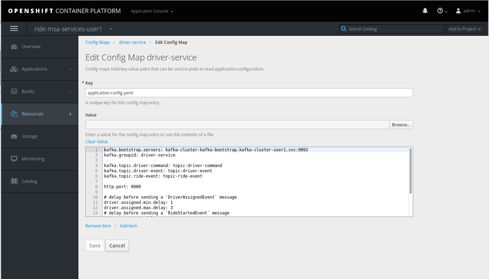
** Add the Jaeger configuration settings to the `application-config.yaml` entry.
** Click _Save_.

. Modify the build pipeline for the driver service to build from the tracing branch.
* In the OpenShift console, navigate to the tools project, and then to the _Builds -> Pipelines_ pane. Click on the _Edit Pipeline_ link of the `driver-service-pipeline` pipeline. An editor for the Jenkins file opens.
* At line 15, change the branch to build from `master` to `tracing`.
+
image::images/openshift_build_pipeline_edit.png[]
* Click _Save_.
. Trigger a new run of the pipeline. The pipeline should complete without errors.
. Replace the deploymentconfig of the driver service with a deploymentconfig that includes the Jaeger agent side-car container.
* In a terminal, change directory to the folder where you cloned the `installation` project of the lab material.
* Review the `openshift/driver-service/driver-service-tracing-template.yaml` template. +
Notice the second (side-car) container definition, named `jaeger-agent` and using the `jaegertracing/jaeger-agent` image. The agent is set up to transmit tracing samples using gRPC to the jaeger-collector service on port 14250.
* Replace the deploymentconfig:
+
----
$ oc3 delete dc driver-service -n $SERVICES_PRJ
$ oc3 process -f openshift/driver-service/driver-service-tracing-template.yaml -p APPLICATION_NAME=driver-service -p APPLICATION_CONFIGMAP=driver-service -p JAEGER_COLLECTOR_NAMESPACE=$TOOLS_PRJ | oc3 create -f - -n $SERVICES_PRJ
----
. A new deployment of the driver service starts. Note that the pod consists of two containers.
+
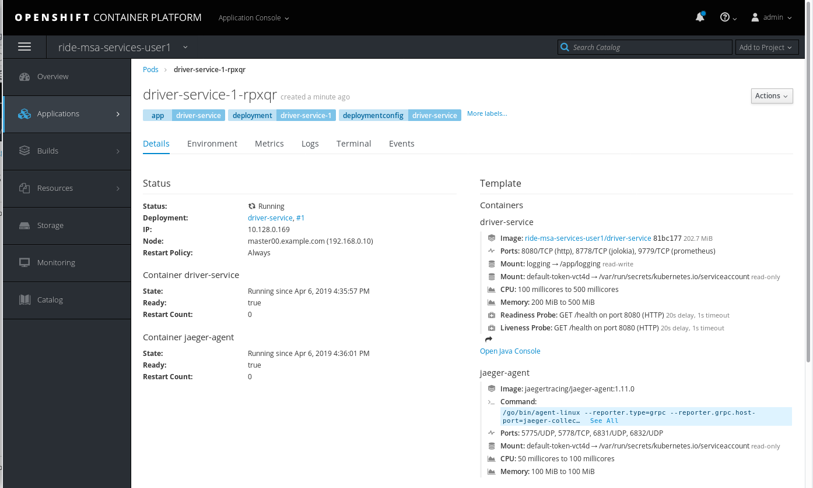
. . Check the logs of the driver service container. Scroll through the logs until you find the log entry for the configuration of the Jaeger tracer:
+
----
2019-04-06 14:36:02.624  INFO   --- [ntloop-thread-0] io.jaegertracing.Configuration           : Initialized tracer=Tracer(version=Java-0.27.0, serviceName=driver-service, reporter=RemoteReporter(queueProcessor=RemoteReporter.QueueProcessor(open=true), sender=UdpSender(udpTransport=ThriftUdpTransport(socket=java.net.DatagramSocket@2ce1a306, receiveBuf=null, receiveOffSet=-1, receiveLength=0)), closeEnqueueTimeout=1000), sampler=RateLimitingSampler(maxTracesPerSecond=1.0, tags={sampler.type=ratelimiting, sampler.param=1.0}), ipv4=176160937, tags={hostname=driver-service-1-rpxqr, jaeger.version=Java-0.27.0, ip=10.128.0.169}, zipkinSharedRpcSpan=false, baggageSetter=io.jaegertracing.baggage.BaggageSetter@3e41521d, expandExceptionLogs=false)
----
. Check the logs of the jaeger-agent container. Expect to see something like:
+
----
{"level":"info","ts":1554561361.9186995,"caller":"agent/main.go:87","msg":"Registering metrics handler with HTTP server","route":"/metrics"}
{"level":"info","ts":1554561361.9190972,"caller":"agent/main.go:91","msg":"Starting agent"}
{"level":"info","ts":1554561361.919445,"caller":"app/agent.go:68","msg":"Starting jaeger-agent HTTP server","http-port":5778}
----

=== Add tracing to the Passenger service

The steps to follow are essentially the same as for the driver service.

. In a terminal window on your workstation, change directory to the directory where you cloned the passenger service source code from GitHub. +
Checkout the `tracing` branch, and push the branch to the gogs repository.
+
----
$ git checkout tracing
$ git push -u gogs tracing
----
. Add Jaeger tracing configuration to the passenger service configmap.
* Open the passenger service configmap for editing:
+
----
$ oc3 edit configmap passenger-service -o yaml -n $SERVICES_PRJ
----
* The configmap descriptor opens in a _vi_ editor. Add the following to the `application.properties` entry of the configmap. This is a YAML file, so indentation is important!
+
----
jaeger.service-name=passenger-service
jaeger.sampler-type=ratelimiting
jaeger.sampler-param=1
jaeger.reporter-log-spans=false
jaeger.agent-host=localhost
jaeger.agent-port=6831
----
+
Refer to the previous paragraph for details about these settings.
* The configmap should look like:
+
----
# Please edit the object below. Lines beginning with a '#' will be ignored,
# and an empty file will abort the edit. If an error occurs while saving this file will be
# reopened with the relevant failures.
#
apiVersion: v1
data:
  application.properties: |-
    kafka.bootstrap-address=kafka-cluster-kafka-bootstrap.kafka-cluster-user1.svc:9092
    kafka.group-id=passenger-service
    kafka.concurrency=5

    sender.destination.ride-requested=topic-ride-event
    sender.destination.passenger-canceled=topic-passenger-event

    listener.destination.driver-assigned=topic-driver-event

    scheduler.pool.size=5
    scheduler.delay.min=1
    scheduler.delay.max=3

    logging.config=file:/app/logging/logback.xml
    logging.level.com.acme.ride=DEBUG
    logging.level.com.acme.ride.passenger.tracing=INFO

    jaeger.service-name=passenger-service
    jaeger.sampler-type=ratelimiting
    jaeger.sampler-param=1
    jaeger.reporter-log-spans=false
    jaeger.agent-host=localhost
    jaeger.agent-port=6831

kind: ConfigMap
metadata:
  creationTimestamp: 2019-04-04T20:24:04Z
  name: passenger-service
  namespace: ride-msa-services-user1
  resourceVersion: "20648"
  selfLink: /api/v1/namespaces/ride-msa-services-user1/configmaps/passenger-service
  uid: 974dfd5c-5717-11e9-95c2-2cabcdef0010
----
* Save the configmap.
* If you are not familiar with _vi_, you can also edit the configmap in the OpenShift Console.
. Modify the build pipeline for the passenger service to build from the tracing branch.
. Trigger a new run of the pipeline. The pipeline should complete without errors.
. Replace the deploymentconfig of the passenger service with a deploymentconfig that includes the Jaeger agent side-car container.
* In a terminal, change directory to the folder where you cloned the `installation` project of the lab material.
* Replace the deploymentconfig:
+
----
$ oc3 delete dc passenger-service -n $SERVICES_PRJ
$ oc3 process -f openshift/passenger-service/passenger-service-tracing-template.yaml -p APPLICATION_NAME=passenger-service -p APPLICATION_CONFIGMAP=passenger-service -p JAEGER_COLLECTOR_NAMESPACE=$TOOLS_PRJ | oc3 create -f - -n $SERVICES_PRJ
----
. A new deployment of the passenger service starts. Note that the pod consists of two containers.
. Check the logs of the passenger service container. Scroll through the logs until you find the log entry for the configuration of the Jaeger tracer:
+
----
2019-04-06 15:07:04.331  INFO 1 --- [           main] io.jaegertracing.Configuration           : Initialized tracer=Tracer(version=Java-0.27.0, serviceName=passenger-service, reporter=RemoteReporter(queueProcessor=RemoteReporter.QueueProcessor(open=true), sender=UdpSender(udpTransport=ThriftUdpTransport(socket=java.net.DatagramSocket@1e1a0406, receiveBuf=null, receiveOffSet=-1, receiveLength=0)), closeEnqueueTimeout=1000), sampler=RateLimitingSampler(maxTracesPerSecond=1.0, tags={sampler.type=ratelimiting, sampler.param=1.0}), ipv4=176160944, tags={hostname=passenger-service-2-hbqm4, jaeger.version=Java-0.27.0, ip=10.128.0.176}, zipkinSharedRpcSpan=false, baggageSetter=io.jaegertracing.baggage.BaggageSetter@3cebbb30, expandExceptionLogs=false)
----

=== Add tracing to the Dispatch service

. In a terminal window on your workstation, change directory to the directory where you cloned the dispatch service source code from GitHub. +
Checkout the `tracing` branch, and push the branch to the gogs repository.
+
----
$ git checkout tracing
$ git push -u gogs tracing
----
. Add Jaeger tracing configuration to the dispatch service configmap.
* Open the dispatch service configmap for editing:
+
----
$ oc3 edit configmap dispatch-service -o yaml -n $SERVICES_PRJ
----
* The configmap descriptor opens in a _vi_ editor. Add the following to the `application.properties` entry of the configmap. This is a YAML file, so indentation is important!
+
----
jaeger.service-name=dispatch-service
jaeger.sampler-type=ratelimiting
jaeger.sampler-param=1
jaeger.reporter-log-spans=False
jaeger.agent-host=localhost
jaeger.agent-port=6831
----
+
Refer to the previous paragraph for details about these settings.
* The configmap should look like:
+
----
# Please edit the object below. Lines beginning with a '#' will be ignored,
# and an empty file will abort the edit. If an error occurs while saving this file will be
# reopened with the relevant failures.
#
apiVersion: v1
data:
  application.properties: |-
    postgresql.host=dispatch-service-postgresql

    spring.datasource.username=jboss
    spring.datasource.password=jboss
    spring.datasource.url=jdbc:postgresql://${postgresql.host}:5432/rhpam

    jbpm.quartz.configuration=/app/config/jbpm-quartz.properties
    quartz.datasource.username=${spring.datasource.username}
    quartz.datasource.password=${spring.datasource.password}
    quartz.datasource.url=${spring.datasource.url}
    quartz.datasource.dbcp2.maxTotal=20

    narayana.dbcp.maxTotal=20

    kafka.bootstrap-address=kafka-cluster-kafka-bootstrap.kafka-cluster-user1.svc:9092
    kafka.group-id=dispatch-service
    kafka.concurrency=5

    listener.destination.ride-event=topic-ride-event
    listener.destination.driver-assigned-event=topic-driver-event
    listener.destination.passenger-canceled-event=topic-passenger-event

    send.destination.assign_driver_command=topic-driver-command
    send.destination.handle_payment_command=topic-passenger-command

    dispatch.assign.driver.expire.duration=5M

    logging.config=file:/app/logging/logback.xml
    logging.level.org.jbpm.executor.impl=WARN
    logging.level.org.apache.kafka.clients=WARN
    logging.level.org.hibernate.orm.deprecation=ERROR
    logging.level.com.acme.ride=DEBUG
    logging.level.com.acme.ride.dispatch.tracing=INFO

    jaeger.service-name=dispatch-service
    jaeger.sampler-type=ratelimiting
    jaeger.sampler-param=1
    jaeger.reporter-log-spans=False
    jaeger.agent-host=localhost
    jaeger.agent-port=6831

  jbpm-quartz.properties: |
    #============================================================================
    # Configure Main Scheduler Properties
    #============================================================================
...
----
* Save the configmap.
* If you are not familiar with _vi_, you can also edit the configmap in the OpenShift Console.
. Modify the build pipeline for the dispatch service to build from the tracing branch.
. Trigger a new run of the pipeline. The pipeline should complete without errors.
. Replace the deploymentconfig of the dispatch service with a deploymentconfig that includes the Jaeger agent side-car container.
* In a terminal, change directory to the folder where you cloned the `installation` project of the lab material.
* Replace the deploymentconfig:
+
----
$ oc3 delete dc dispatch-service -n $SERVICES_PRJ
$ oc3 process -f openshift/dispatch-service/dispatch-service-tracing-template.yaml -p APPLICATION_NAME=dispatch-service -p APPLICATION_CONFIGMAP=dispatch-service -p JAEGER_COLLECTOR_NAMESPACE=$TOOLS_PRJ | oc3 create -f - -n $SERVICES_PRJ
----
. A new deployment of the dispatch service starts. Note that the pod consists of two containers.
. Check the logs of the dispatch service container. Scroll through the logs until you find the log entry for the configuration of the Jaeger tracer:
+
----
2019-04-06 15:35:41.831  INFO 1 --- [           main] io.jaegertracing.Configuration           : Initialized tracer=Tracer(version=Java-0.27.0, serviceName=dispatch-service, reporter=RemoteReporter(queueProcessor=RemoteReporter.QueueProcessor(open=true), sender=UdpSender(udpTransport=ThriftUdpTransport(socket=java.net.DatagramSocket@5dbb50f3, receiveBuf=null, receiveOffSet=-1, receiveLength=0)), closeEnqueueTimeout=1000), sampler=RateLimitingSampler(maxTracesPerSecond=1.0, tags={sampler.type=ratelimiting, sampler.param=1.0}), ipv4=176160950, tags={hostname=dispatch-service-2-n8lvm, jaeger.version=Java-0.27.0, ip=10.128.0.182}, zipkinSharedRpcSpan=false, baggageSetter=io.jaegertracing.baggage.BaggageSetter@4a2e7bcb, expandExceptionLogs=false)
----

=== Tracing in action

. In a terminal window, use _curl_ to call the REST endpoint of the passenger service:
+
----
$ curl -X POST -H "Content-type: application/json" -d '{"messages": 1, "type": 1}' $PASSENGER_SERVICE_URL/simulate
----
. Wait a couple of seconds for the dispatch process to complete. Navigate to the Jaeger UI in a browser window. In the left pane, select `passenger-service` in the `Service` drop down box. Click `Find Traces`. +
Expect to see one trace, generated from the REST call:
+
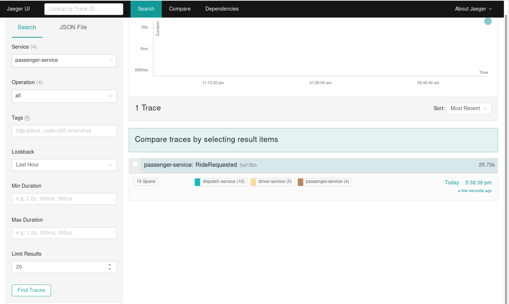
* The trace consists of 19 spans, divided over the three services of the application.
. Click on the span to see the different spans and their relationships:
+
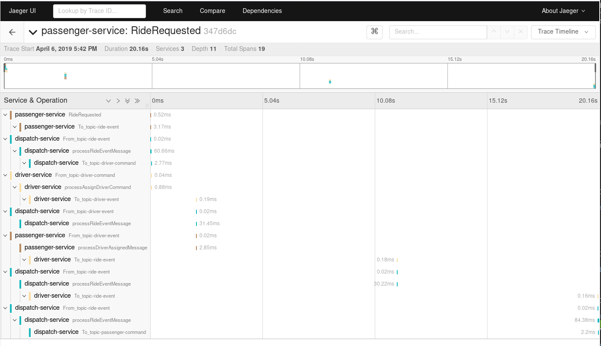
* The spans reflect the message flow throughout the system
* For Kafka consumers and producers, the duration is very short (couple of milliseconds or less), which is expected as the span wraps just the consuming or sending of the message.
. Click on a particular span to see the different tags and metadata attached to the span:
+
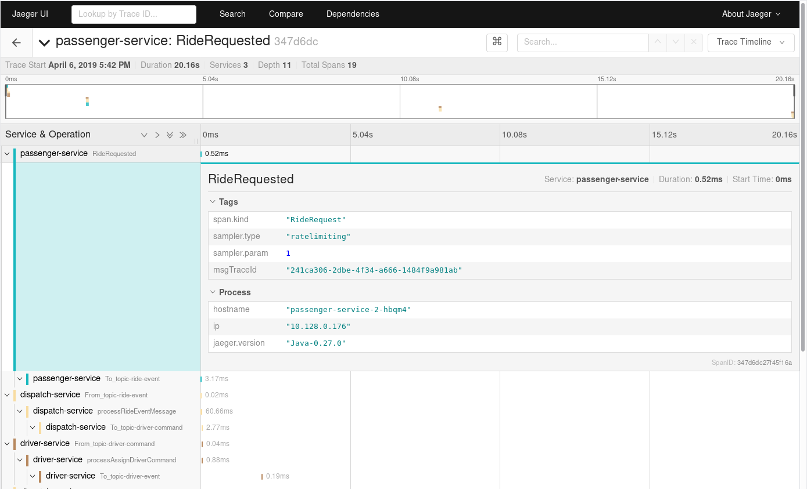
* Note the `msgTraceId` which was specifically added as a tag to the span in the implementation of the passenger service.
. In a terminal window, use _curl_ to call the REST endpoint of the passenger service to send a request that will be canceled by the passenger:
+
----
$ curl -X POST -H "Content-type: application/json" -d '{"messages": 1, "type": 2}' $PASSENGER_SERVICE_URL/simulate
----
. In the Jaeger UI, navigate to the landing page. Refresh the traces by clicking on the `Find Traces` button. Expect to see a second trace, with 15 spans. Click on the trace to see the details:
+
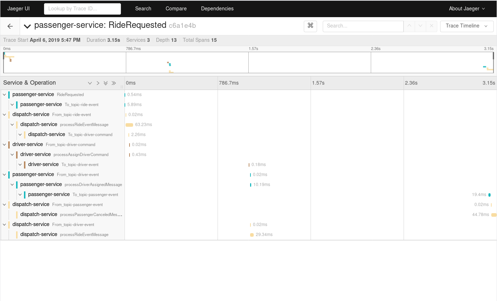
. In a terminal window, use _curl_ to call the REST endpoint of the passenger service to send a request that will remain unassigned:
+
----
$ curl -X POST -H "Content-type: application/json" -d '{"messages": 1, "type": 3}' $PASSENGER_SERVICE_URL/simulate
----
. In the Jaeger UI, navigate to the landing page. Refresh the traces. The most recent trace has 7 spans.
+
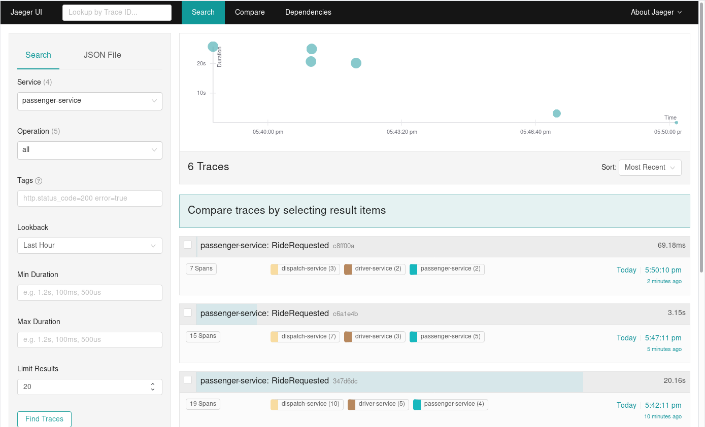
+
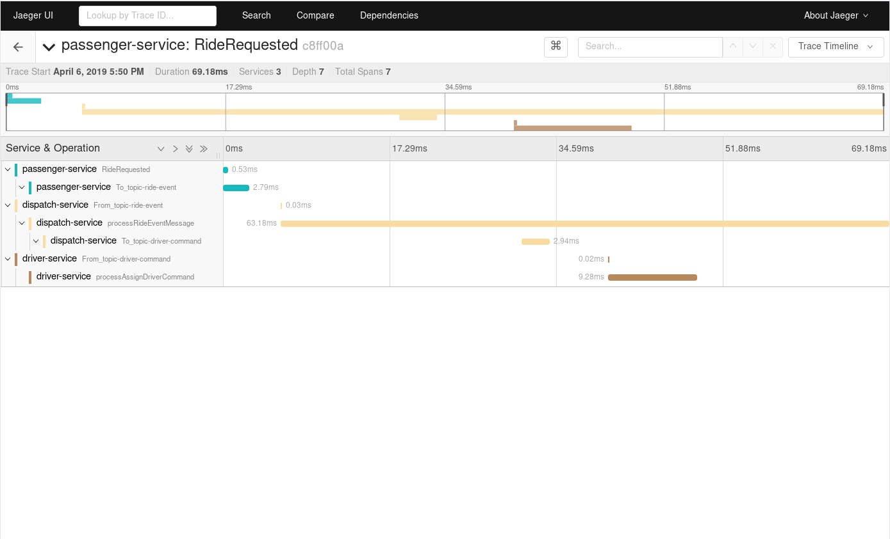

== Monitoring

Application performance monitoring is essential to be able to assert that your applications work and perform as expected and deliver the expected business value.

There are numerous tools and products on the market that provide monitoring capabilities at infrastructure and application level, both open-source and proprietary.

https://prometheus.io[Prometheus] is rapidly gaining traction as the open-source monitoring tool for cloud-native applications. Prometheus will be integrated into OpenShift to provide cluster-wide monitoring capabilities at the infrastructure level, but it is equally well suited for application-level monitoring.

The central component of Prometheus is the Prometheus server. The Prometheus server scrapes targets at a configurable interval to collect metrics from specific targets and store them in a time-series database. Targets—​the systems or applications that need to be monitored—​ typically expose an HTTP endpoint providing metrics. Prometheus has a wide range of service discovery options to find the target services and start retrieving metrics from them, including integration with OpenShift/Kubernetes.

The data gathered and stored by the Prometheus server can be queried using the PromQL language. The Prometheus UI has some limited capacities to show graphs from the collected metrics. Prometheus is often used together with https://grafana.com[Grafana] to provide dashboards on top of the metrics collected by Prometheus.

This diagram illustrates the architecture of Prometheus:

image::images/prometheus_architecture.png[]

In this section of the lab you deploy Prometheus in your OpenShift environment, and configure it to scrape metrics from the Kafka broker, the dispatch service and the dispatch service database.

=== Deploy Prometheus

We use an Ansible playbook to install Prometheus on OpenShift. +
The playbook:

* Creates a service account for Prometheus.
* Gives the Prometheus service account cluster view rights in the tools, services and kafka cluster projects. +
On OpenShift/Kubernetes, the discovery mechanism of Prometheus uses the Kubernetes API to discover targets, and this requires cluster view access rights.
* Creates a configmap with the Prometheus configuration and Prometheus recording rules files for the Kafka cluster and the Dispatch service.
** The Prometheus configuration defines the scrape jobs for the prometheus pods.
** Prometheus recording rules allow you to precompute frequently needed or computationally expensive expressions and save their result as a new set of time series.
* Deploys Prometheus on the OpenShift cluster. For this lab, we use non-persistent storage for the data collected by Prometheus.

{empty} +

. Make sure you are logged in with the `oc` client into your OpenShift environment.
. In a terminal, change directory to the folder where you cloned the `installation` project of the lab material.
. Review the `openshift/prometheus/prometheus-template.yaml` OpenShift template file. The template defines the route, service and deployment for Prometheus.
* By default, the Prometheus UI web application is exposed over port 9090.
* The Prometheus image runs under the prometheus service account.
* The Prometheus metric data are stored on temporary storage on the pod’s node.
* The data retention time is set to 6 hours.
* The prometheus configmap is mounted inside the Prometheus pod in the etc/prometheus directory.
. Review the `openshift/prometheus/prometheus.yaml` Prometheus configuration file, and the `openshift/prometheus/kafka.rules` and `openshift/prometheus/dispatch-service.rules` Prometheus rule files.
* The `prometheus.yaml` configuration file defines the scrape jobs for prometheus. It defines scrape jobs for kafka, the dispatch service and prometheus-sql.
** For a detailed overview of the Prometheus configuration settings, refer to the https://prometheus.io/docs/prometheus/latest/configuration/configuration/[Prometheus configuration documentation]
** `scrape_configs` contains the configuration settings for the scraping jobs.
** There are three scraping jobs, with type `kubernetes_sd_configs`.
** Kubernetes SD configurations allow retrieving scrape targets from the Kubernetes REST API and always staying synchronized with the cluster state.
** A Kubernetes SD configuration has a role type to discover targets. Supported role types include node, pod, service, endpoint, ingress. The role type for the kafka job is endpoint. The endpoints role discovers targets from listed endpoints of a service. For each endpoint address one target is discovered per port.
** The `namespaces` configuration allows to restrict the discovery of targets to a specified set of namespaces. For the `kafka` scraping job, the discovery is limited to the namespace of the Kafka broker.
** `relabel_configs`: Relabeling is a powerful tool to dynamically rewrite the label set of a target before it gets scraped. Please refer to the Prometheus documentation for full details. +
* The `kafka.rules` rules file has some examples for pre-computed metrics for Kafka. The rules calculate the rate per minute at which messages are added to each of the Kafka topics, as well as the total amount of memory and cpu consumed by the kafka cluster pods.
* The `dispatch-service.rules` rules file contains pre-computed metrics based on data collected from the Dispatch service and the database.
. Change directory to the `ansible` folder. Run the `prometheus.yml` playbook.
+
----
$ cd ansible
$ ansible-playbook playbooks/prometheus.yml
----
. Expect the playbook to run to completion without failures.
. Get the URL for the `prometheus` route:
+
----
$ echo "http://$(oc3 get route prometheus -o jsonpath='{.spec.host}' -n $TOOLS_PRJ)"
----
. In a browser window, navigate to the URL of the `prometheus` route. Expect to see the Prometheus UI landing page:
+
image::images/prometheus_landing_page.png[]
. In the Prometheus UI, navigate to _Status -> Targets_. Expect to see the scrape targets as defined in the Prometheus configuration file. Notice that only the `Kafka` target is up. There are six endpoints discovered - corresponding to the three Zookeeper pods and the three Kafka broker pods.
+
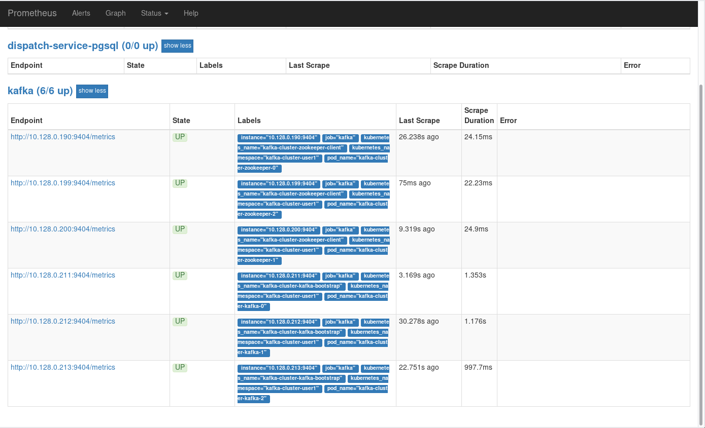
. In the Prometheus UI, navigate to _Status -> Rules_. Expect to see the Prometheus rules as defined in the `dispatch-service.rules` and `kafka.rules` Prometheus rule files.
+
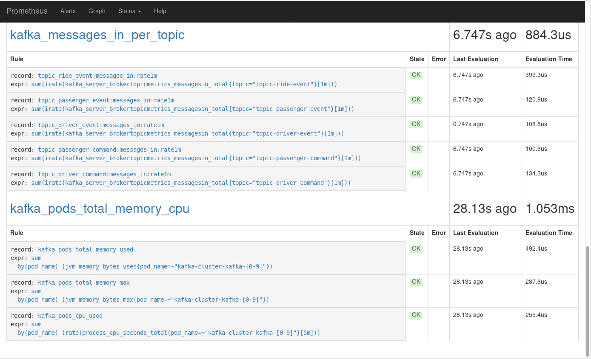
. In the Prometheus UI, navigate to the landing page, and open the metrics drop-down to see an overview of the metrics exposed by the Kafka and Zookeeper pods. Note that the metrics defined in the rule file appear as well in the list.
+
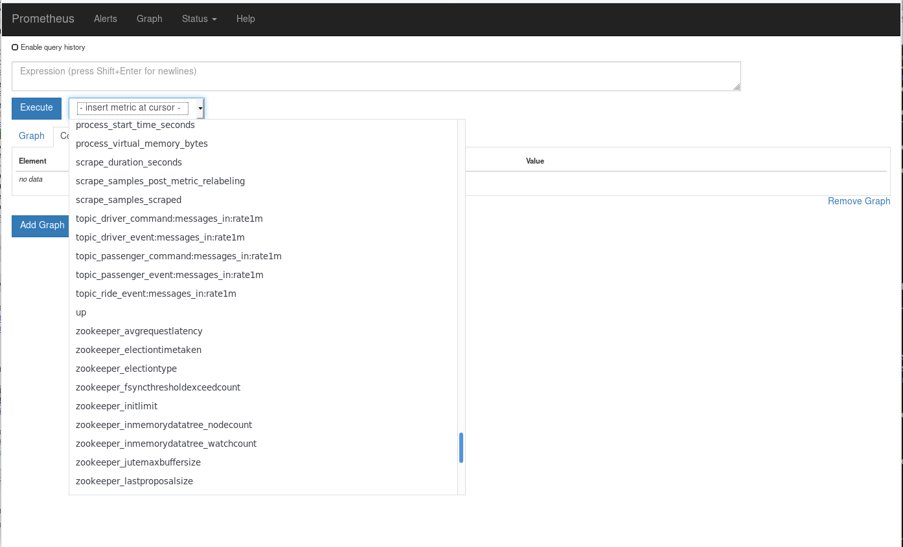
. Prometheus has rudimentary metric plotting functionality. As an example, select the `kafka_pods_total_memory_used` metric from the metrics drop-down list. Click _Execute_ to display the metric values.
+
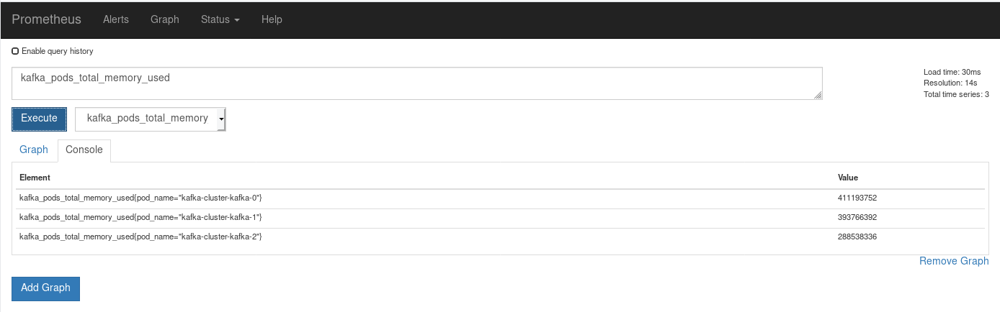
. Click on the _Graph_ tab to see a graphical representation of the metric data.
+
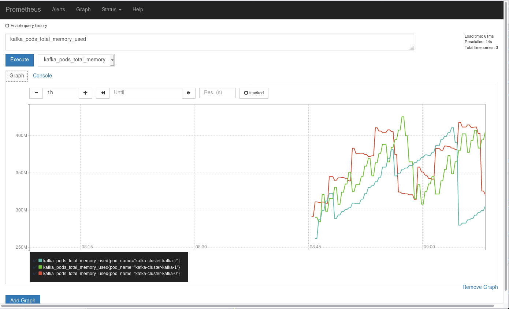
+
Later in the lab, we will use Grafana to build a dahboard out of the metrics collected by Prometheus.

=== Instrumenting the dispatch service

Micrometer (https://micrometer.io/) is a monitoring library which provides a simple facade over the instrumentation clients for the most popular monitoring systems, allowing you to instrument your JVM-based application code without vendor lock-in. Think SLF4J, but for metrics. As the default monitoring and instrumenting library for Spring Boot (since version 2.0), it is rapidly gaining popularity in the community.

Out of the box, micrometrics will expose system metrics such as cpu and memory consumption, and will also auto-discover application components such as the embedded Tomcat server or datasources. Micrometer also allows to instrument application code to expose application specific metrics.

Micrometer comes with a number of exporters, one of these being a Prometheus exporter. Using this exporter allows to expose the metrics as a Prometheus endpoint.

The `micrometer` branch of dispatch service project contains a version of the dispatch service instrumented with Micrometer.

Since Spring Boot 2.0, Micrometer is automatically added to the project dependencies when using Spring Boot Actuator.

* The following dependencies were added to the project `pom.xml` file:
+
----
    <dependency>
      <groupId>io.micrometer</groupId>
      <artifactId>micrometer-registry-prometheus</artifactId>
    </dependency>
----
+
** `micrometer-registry-prometheus` exposes the metrics collected by Micrometer as Prometheus scraping endpoint.

* The code of the `RideEventsMessageListener`, `PassengerCanceledEventMessageListener` and `DriverAssignedMessageListener` classes have been instrumented with Micrometer code to measure the time required to process incoming messages.
+
----
@Component
public class RideEventsMessageListener {

    @Autowired
    private MeterRegistry meterRegistry;

[...]

    private Map<String, Timer> timers = new HashMap<>();

    @PostConstruct
    public void initTimers() {
        timers.put(TYPE_RIDE_REQUESTED_EVENT, Timer.builder("dispatch-service.message.process").tags("type",TYPE_RIDE_REQUESTED_EVENT).register(meterRegistry));
        timers.put(TYPE_RIDE_STARTED_EVENT, Timer.builder("dispatch-service.message.process").tags("type",TYPE_RIDE_STARTED_EVENT).register(meterRegistry));
        timers.put(TYPE_RIDE_ENDED_EVENT, Timer.builder("dispatch-service.message.process").tags("type",TYPE_RIDE_ENDED_EVENT).register(meterRegistry));
    }

[...]

    private void timedProcessMessage(String messageType, String messageAsJson) {
        Optional<Timer> timer = Optional.ofNullable(timers.get(messageType));
        long start = System.currentTimeMillis();
        try {
            switch (messageType) {
                case TYPE_RIDE_REQUESTED_EVENT:
                    processRideRequestEvent(messageAsJson);
                    break;
                case TYPE_RIDE_STARTED_EVENT:
                    processRideStartedEvent(messageAsJson);
                    break;
                case TYPE_RIDE_ENDED_EVENT:
                    processRideEndedEvent(messageAsJson);
                    break;
            }
        } finally {
            timer.ifPresent(t -> t.record(System.currentTimeMillis() - start, TimeUnit.MILLISECONDS));
        }
    }

}
----

In this section of the lab we deploy the instrumented version of the dispatch service and configure prometheus to collect metrics from the application.

. In a terminal window on your workstation, change directory to the directory where you cloned the driver service source code from GitHub.
Checkout the `micrometer` branch, and push the branch to the gogs repository.
+
----
$ git checkout micrometer
$ git push -u gogs micrometer
----

. Modify the build pipeline for the dispatch service to build from the micrometer branch.
+
----
[...]
node ('maven-with-pvc') {
  stage ('Compile') {
    echo "Starting build"
    git url: "${git_url}/${git_repo_app}", branch: "micrometer"
[...]
----

. Trigger a new run of the pipeline. The pipeline should complete without errors.

. Check that Micrometer metrics are exposed as Prometheus endpoint. +
In the OpenShift console, navigate to the dispatch service pod, click on the `Terminal` tab and type `curl localhost:8080/actuator/prometheus`. Expect to see the metrics exposed by Micrometer in Prometheus format:
+
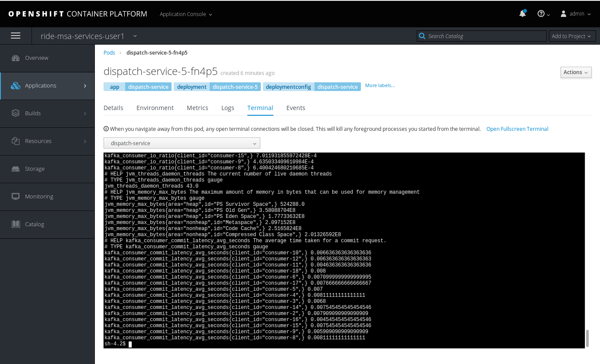

. The Prometheus discovery mechanism for Kubernetes endpoints uses annotations on the service to discover endpoints that need to be scraped. +
. Patch the `dispatch-service` service to add the required annotations for the Prometheus scraping job:
+
----
$ oc3 patch service dispatch-service -p '{"metadata":{"annotations":{"prometheus.io/path":"/actuator/prometheus","prometheus.io/port":"8080","prometheus.io/scrape":"true"}}}' -n $SERVICES_PRJ
----

. In a browser window, navigate to the Prometheus UI. Go to `Status -> Targets`. Expect to see that the dispatch service target has been discovered:
+
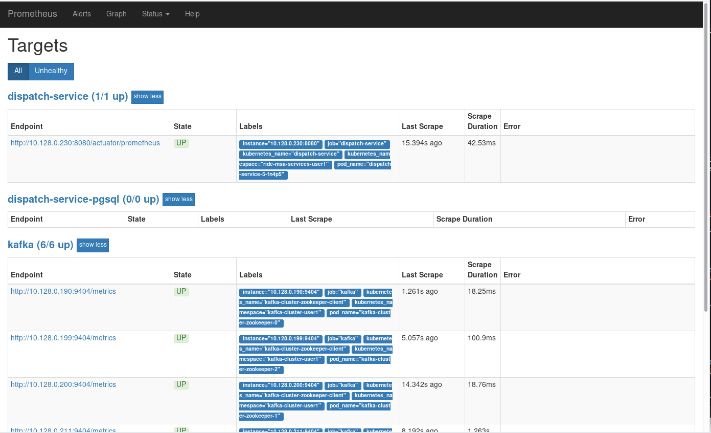

. On the Prometheus landing page, open the metric drop-down box. Notice that the metrics exposed by the dispatch service have been added to the list of available metrics.
+
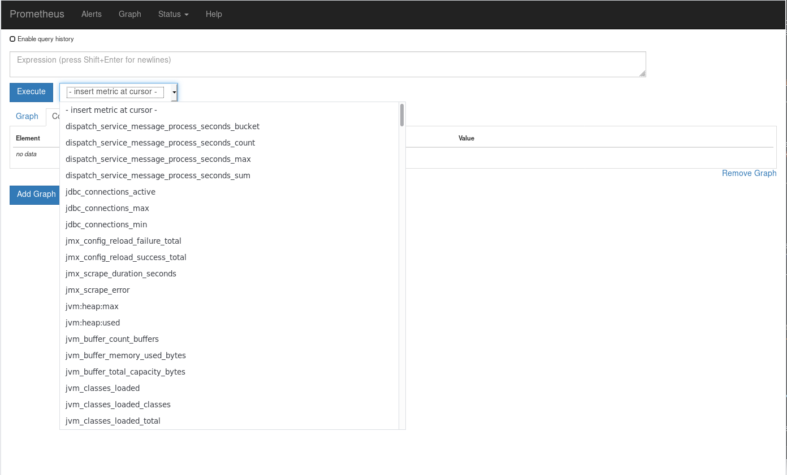

. The `dispatch-service.rules` Prometheus rules file defines some pre-computed metrics. One of them is `message:riderequested:rate5m`, which calculates the avarage time required to process a `RideRequestedEvent` message over a time window of 5 minutes. +
In the Prometheus UI, select the `message:riderequested:rate5m` from the metrics drop-down box, and click _Execute_.
+
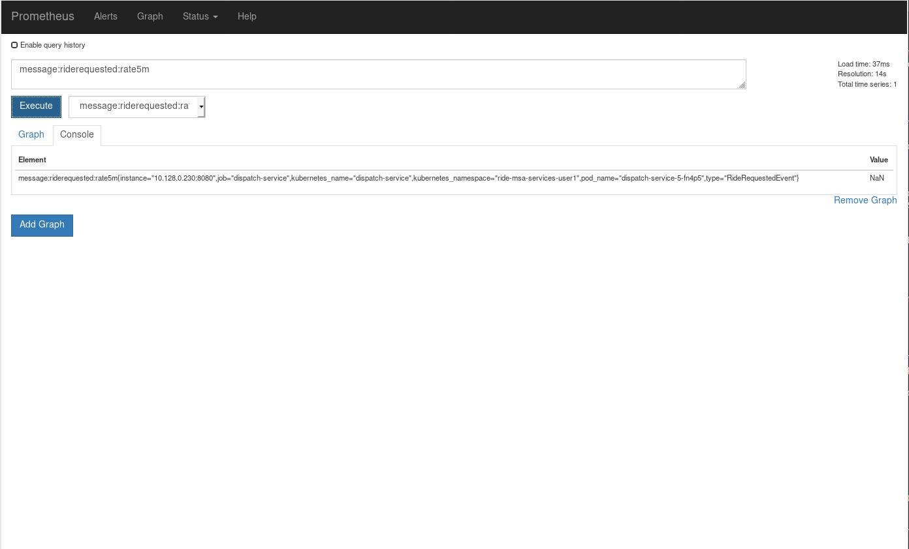
. Put some load on the system:
+
----
$ curl -X POST -H "Content-type: application/json" -d '{"messages": 500, "type": 0}' $PASSENGER_SERVICE_URL/simulate
----
. Observe the graph of the `message:riderequested:rate5m` metrics - you need to click `Execute` to refresh the graph:
+
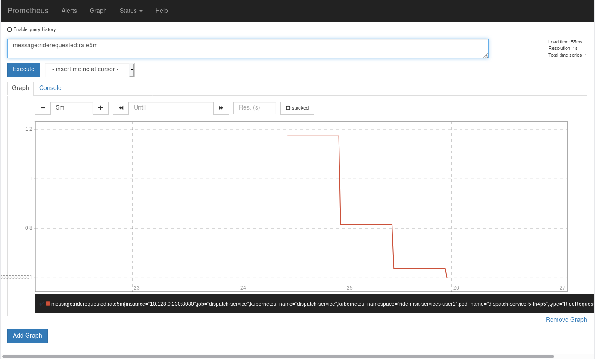

=== SQL metrics

https://github.com/chop-dbhi/prometheus-sql[Prometheus SQL] is a service that generates basic metrics for SQL result sets and exposes them as Prometheus metrics. It executes SQL queries at a regular interval and exposes the resultset as Prometheus compatible time series metrics.

In this section of the lab, we leverage Prometheus SQL to measure the number of `Ride` entities reated per status over a sliding time window, as well as the rate of process instances created.

NOTE: The next release of RHPAM will expose out-of-the-box Prometheus compatible metrics. This will make the need for somethng like Prometheus SQL obsolete.

. In a terminal, change directory to the folder where you cloned the `installation` project of the lab material.
. Review the Prometheus SQL template at `openshift/prometheus-sql/prometheus-sql-template.yaml`.
. Change directory to the `ansible` folder. Run the `prometheus_sql.yml` playbook.
+
----
$ cd ansible
$ ansible-playbook playbooks/prometheus_sql.yml
----
. Expect the playbook to run to completion without failures.
. The playbook deploys the Prometheus SQL pod in the tools project. Prometheus SQL is configured using a configmap. Review the contents of the `prometheus-sql-config` configmap in the tools project:
+
----
$ oc3 get configmap prometheus-sql-config -o yaml -n $TOOLS_PRJ
----
+
----
apiVersion: v1
data:
  prometheus-sql.yml: |
    # Show all possible defaults keys
    defaults:
      data-source: datasource
      query-interval: 10s
      query-timeout: 5s
      query-value-on-error: -1

    # Defined data sources
    data-sources:
      datasource:
        driver: postgresql
        properties:
          host: dispatch-service-postgresql.ride-msa-services-user1.svc
          port: 5432
          user: jboss
          password: jboss
          database: rhpam
          sslmode: disable
  queries.yml: |-
    - ride_per_status:
        sql: >
            SELECT status, count(id) as cnt FROM ride GROUP BY status
        data-field: cnt
    - ride_created:
        sql: >
            SELECT processname, count(1) as cnt FROM processinstancelog GROUP BY processname
        data-field: cnt
kind: ConfigMap
metadata:
...
----
* The database connection properties are defined in `prometheus-sql.yml`.
* The queries to execute are defined in `queries.yml`.
** `data-field` defines which column to expose as metrics.
** The Prometheus metrics are prefixed with `query_result_`.
. Check the logs of the `prometheussql` pod in the tools project. Expect to see something like:
+
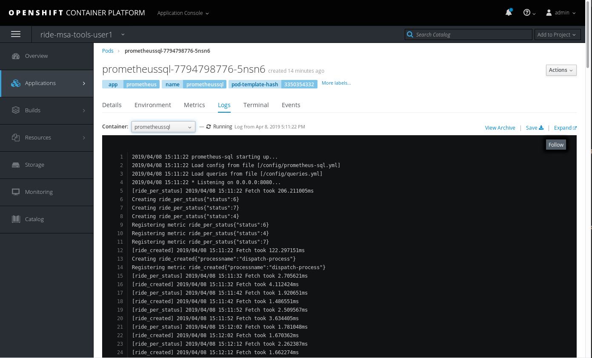

. In a browser window, navigate to the Prometheus UI. Go to _Status -> Targets_. Expect to see that the dispatch service target has been discovered:
+
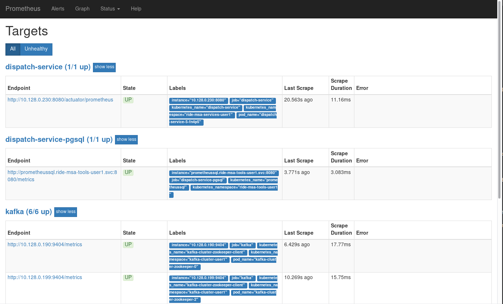

. As part of the `dispatch-service.sql` Prometheus rule file, some pre-computed Prometheus metrics were defined based on the metrics exposed by Prometheus SQL:
+
----
groups:
- name: dispatch_service_ride_status
  rules:
  - record: ride:requested:rate5m
    expr: rate(query_result_ride_per_status{status="1"}[5m])
  - record: ride:assigned:rate5m
    expr: rate(query_result_ride_per_status{status="2"}[5m])
  - record: ride:canceled:rate5m
    expr: rate(query_result_ride_per_status{status="4"}[5m])
  - record: ride:started:rate5m
    expr: rate(query_result_ride_per_status{status="5"}[5m])
  - record: ride:ended:rate5m
    expr: rate(query_result_ride_per_status{status="6"}[5m])
  - record: ride:expired:rate5m
    expr: rate(query_result_ride_per_status{status="7"}[5m])
  - record: ride:created:rate5m
    expr: rate(query_result_ride_created{processname="dispatch-process"}[5m])
----
* The `ride:<status>:rate5m` metrics calculate the per-second rate of `ride` entities per status in the database over the last 5 minutes.
* The `ride:created:rate5m` metric calculates the per-second rate of `dispatch-process` process instances created in the database over the last 5 minutes.

. In the Prometheus UI, navigate to _Status -> Rules_. In the Rules view, navigate to the `dispatch_service_ride_status` section, and click on the `ride:created:rate5m` rule. The rule expression is copied into the metric box in the landing page and executed.
+
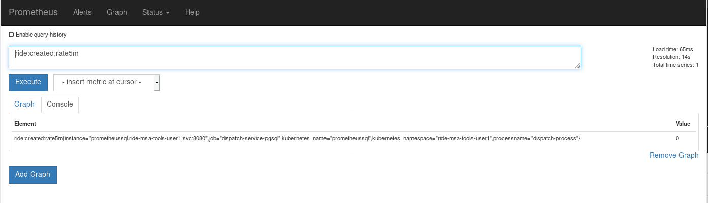
. Put some load on the system:
+
----
$ curl -X POST -H "Content-type: application/json" -d '{"messages": 500, "type": 0}' $PASSENGER_SERVICE_URL/simulate
----
. Observe the graph of the `ride:created:5m` - you need to click `Execute` to refresh the graph:
+
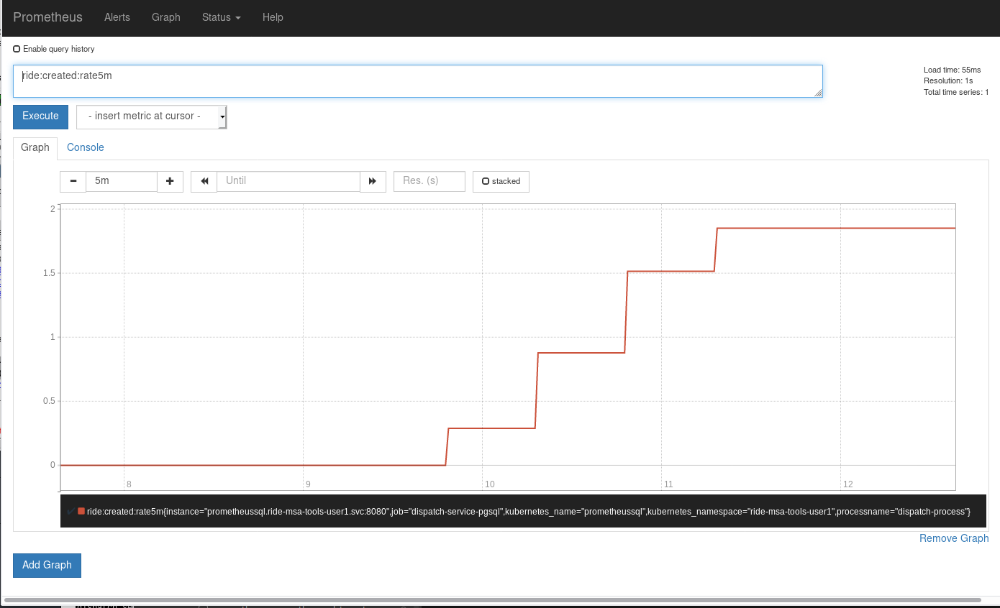

=== Grafana

The Prometheus UI capabilities to visualize metrics data are quite limited, that’s why Grafana is often used in combination with Prometheus to create dashboards.

In this section of the lab you deploy Grafana to OpenShift and create a dashboard based on metrics collected by Prometheus.

We use an Ansible playbook to install Grafana on OpenShift.
The playbook:

* Creates a service account for Grafana.
* Creates a configmap with the Grafana configuration file.
* Deploys Grafana on the Openhift cluster using a template.
* Creates a datasource for Prometheus on Grafana.

{empty} +

. Make sure you are logged in with the `oc` client into your OpenShift environment.
. In a terminal, change directory to the folder where you cloned the `installation` project of the lab material.
. Review the `openshift/grafana/grafana.yaml` template for Grafana.
* The template defines a route, a service and a deployment API object.
* By default, the Grafana UI web application is bound to port 3000.
* The Grafana image runs under the grafana service account.
* The Grafana data is stored on temporary storage on the pod’s node.
* The `grafana-config` configmap is mounted inside the Grafana pod in the `/usr/share/grafana/conf` directory.
. Change directory to the `ansible` folder. Run the `grafana.yml` playbook.
+
----
$ cd ansible
$ ansible-playbook playbooks/grafana.yml
----
. Expect the playbook to run to completion without failures.
. Get the URL for the Grafana route:
+
----
$ echo "http://$(oc3 get route grafana -o jsonpath='{.spec.host}' -n $TOOLS_PRJ)"
----
. In a web browser, navigate to the URL of the Grafana route. Expect to see the Grafana Homepage.
+
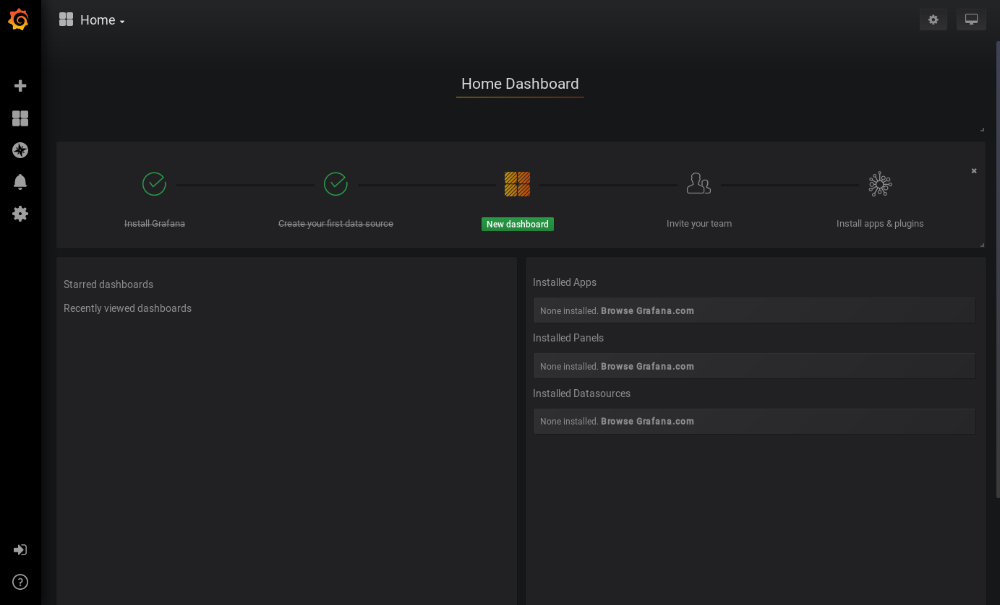
. On the Grafana home page, click on _New dashboard_ to create a dashboard. On the _New Panel_ window, click on _Add Query_.
+
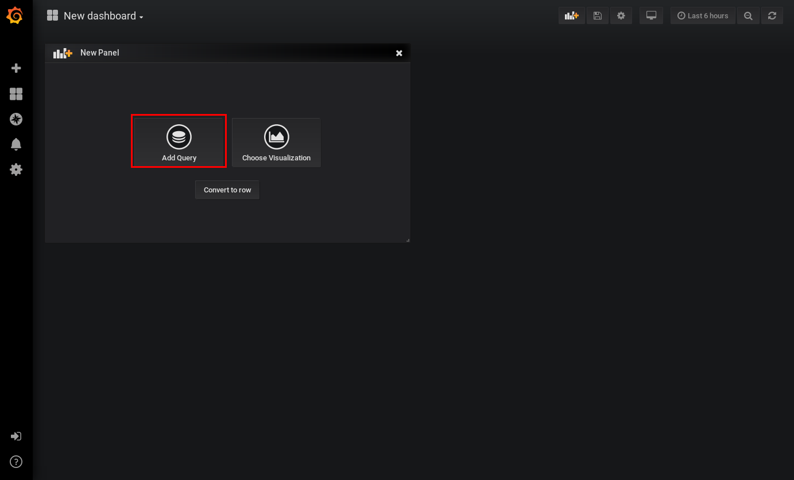
+
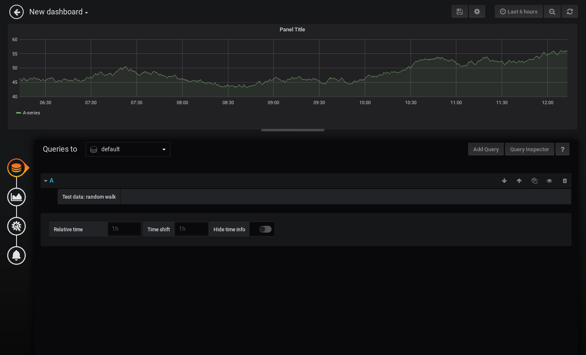
. In the _Queries to_ drop down box, select `Prometheus`. In the query selection area, enter `kafka_pods_max_memory_used`. In the _Legend_ text box, enter `{{pod_name}}`.
+
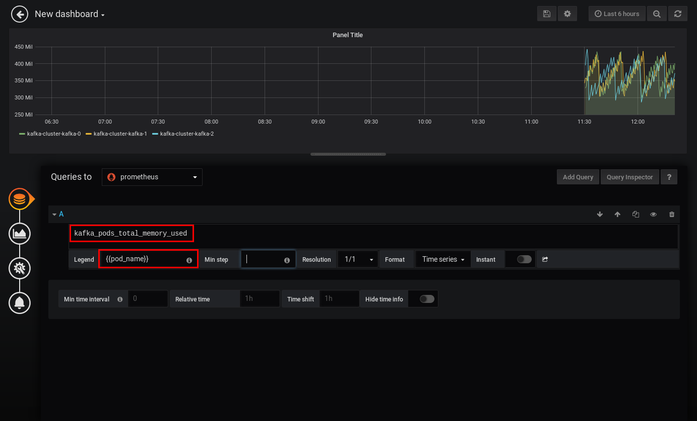
. Click on the _General_ icon on the left, and set the Panel title to `Kafka Memory Used`. Click on the panel title and select _edit_ to switch to the dashboard view.
+
image::images/grafana_panel_kafka_memory_used_edit.png[]
+
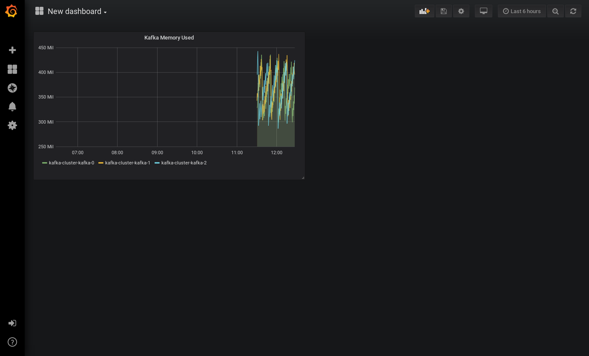
. Click on the _Add panel_ button on the top right to add a new dashboard panel.
* Select the `Prometheus` data source.
* Use the Prometheus `kafka_pods_cpu_used` metric.
* Set the legend to `{{pod_name}}`.
* Set the panel title to `Kafka CPU Used`
+
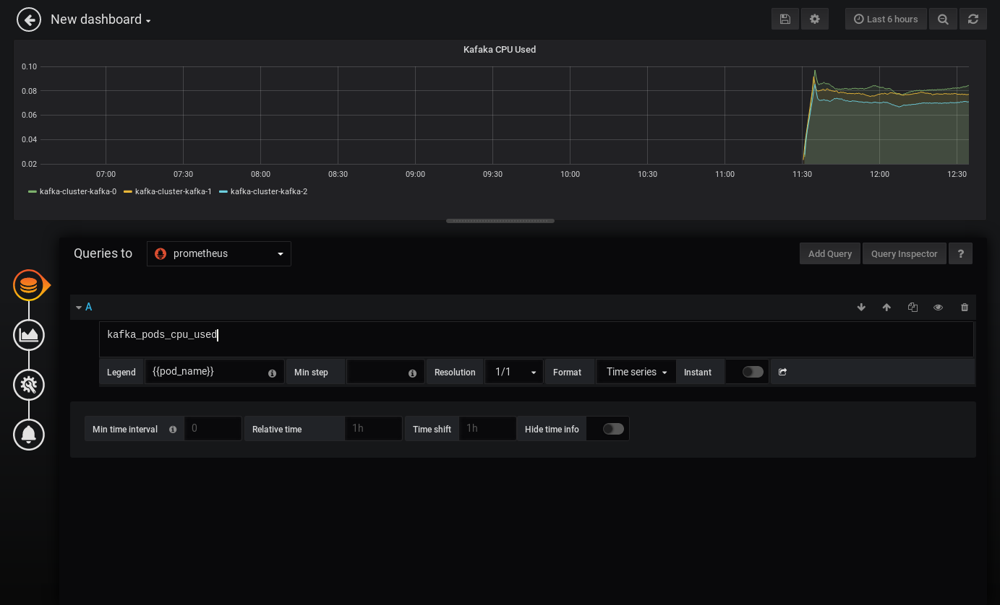
+
* Switch to the dashboard view. Move the second panel next to the first one. The dashboard should look like:
+
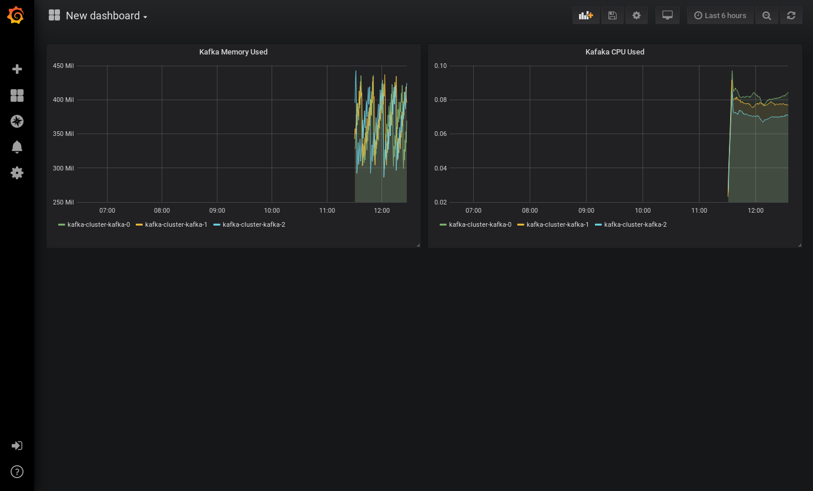
. Add a panel to plot the rate at which messages are sent to each Kafka topic.
* Use the `topic_ride_event:messages_in:rate1m`, `topic_driver_event:messages_in:rate1m`, `topic_passenger_event:messages_in:rate1m`, `topic_driver_command:messages_in:rate1m`, `topic_pssenger_command:messages_in:rate1m` metrics.
+
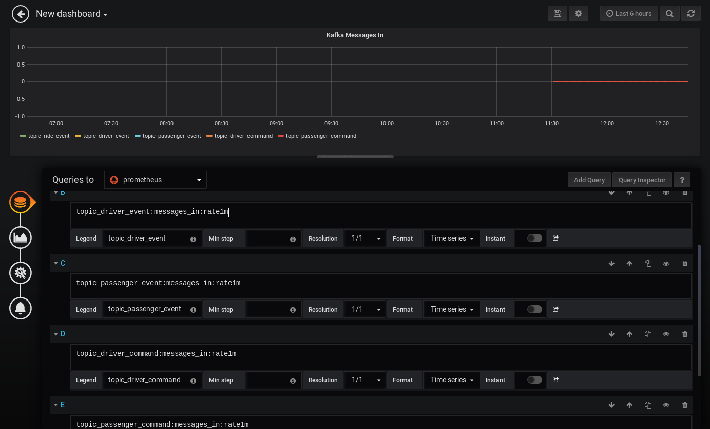
. Create additional dashboard panels for the metrics you are interested in. Suggested metrics are:
* Number of active connections in the datasource pools of the dispatch service.
** Metrics: `jdbc_connections_max` and `jdbc_connections_active`.
* Dispatch service memory and cpu consumption.
** Metrics: `jvm:heap:used`, `system_cpu_usage`.
* Process instances created per minute.
** Metrics: `ride:created:rate5m`.
. Arrange the dashboard panes and adjust the time interval to your liking.
. Put some load on the system to generate data for the dashboard. The `soapui` project in the lab material has a SoapUI load test project. SoapUI is installed on the lab laptop.
* Launch SoapUI, and open the project `acme-ride-soapui-project.xml` in the `soapui` project of the lab material.
* In the custom properties of the SoapUI project, set the value of the `OpenShiftEndpoint` property to the route URL of the passenger service application in OpenShift.
+
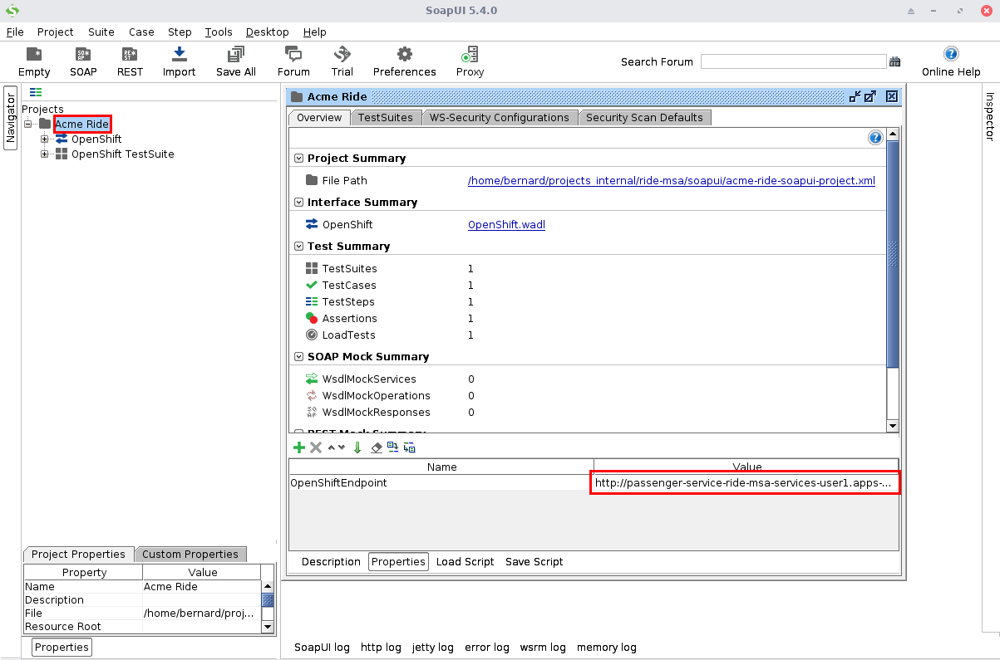
* In the Soapui project, navigate to the `LoadTest 1` load test. Open the load test and click on the green arrow icon to launch the test. The load test will generate approx 3 `RideRequestedEvent` messages per second during 5 minutes
+
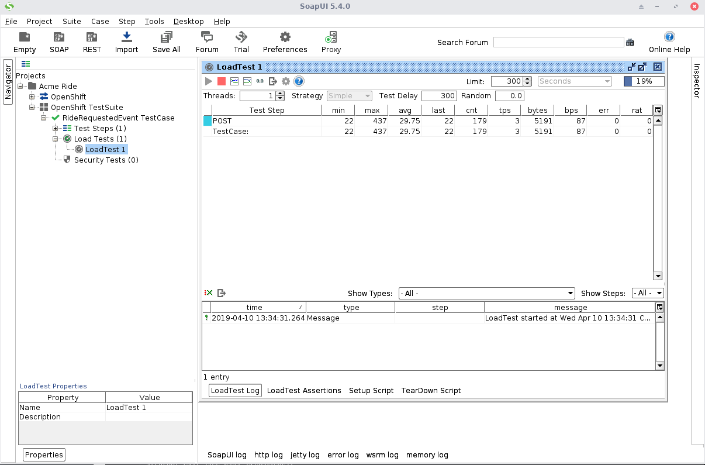
. Observe the Grafana console:
+
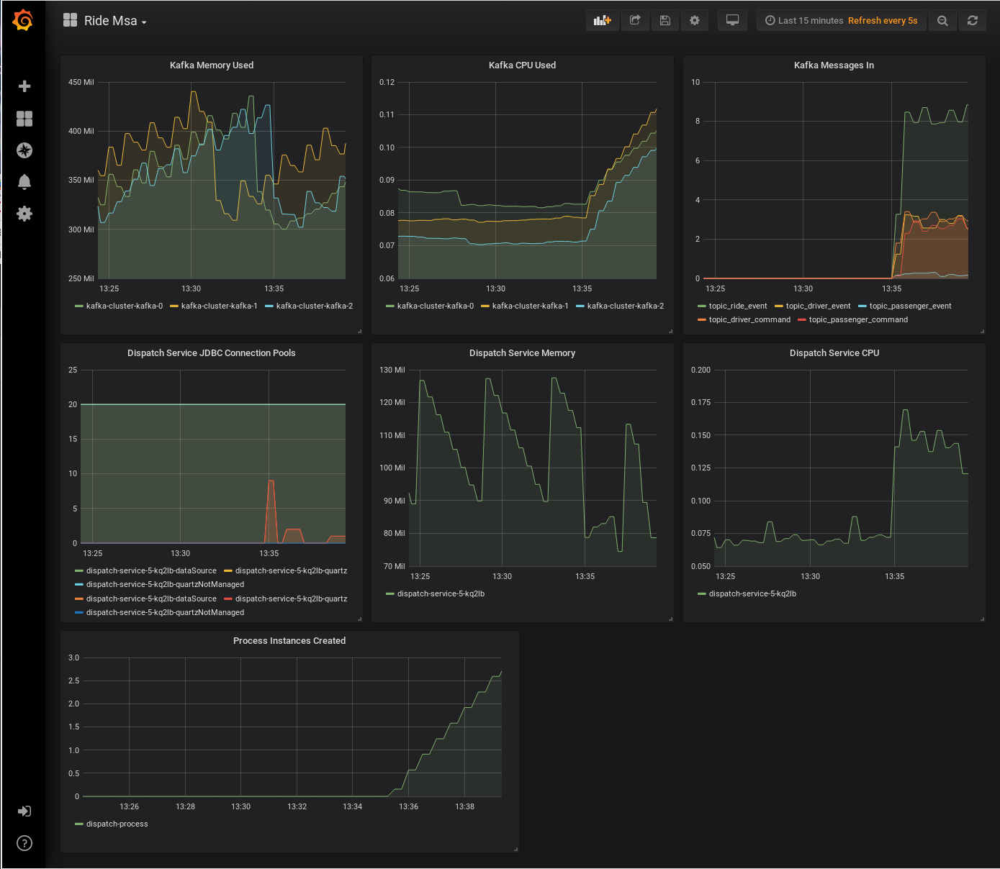

Congratulations! You made it to the end of the lab.

=== Appendix - Technical details

== Technical considerations and choices

* The services in this lab are developed using RHOAR runtimes (Spring Boot, Vert.x)
* The services used in this lab (Passenger service, Driver service, Dispatch service) communicate by sending and consuming messages to and from topics deployed on a message broker.
* The _Ride_ entity encapsulates the state of a ride. The entity is owned by the dispatch service.
* The dispatch server uses the RHPAM process engine to coordinate the message flow between the services and advance the state of the Ride entity.
* The Ride entity is stored in a relational database. +
To keep things simple, the entity is stored in the database schema used by the RHPAM engine.
* The Passenger and Driver service implementations used in this lab are mock implementations. They do however send and consume messages in order to mimick the message flow between the services.

=== RHPAM

When it comes to leveraging the RHPAM engine in a microservice, there are several possibilities. We could use the Process Server as is, but Process Server being a general use business process execution server, it seems a bit heavy-weight for what we need. In the end, the fact that the Dispatch service uses a process engine should be an implementation detail. If we use Process Server as such, the API (be it REST or JMS) would leak to client services, which have to know about Process Server specific things like deployment id's, process instance id's, specific payload structures etc...

The RHPAM engine can also be embedded in a stand-alone application. The product provides Spring Boot starters to make that task easier.

Our embedded engine uses Narayana as transaction manager, PostgreSQL for the database and Quartz to manage persistent timers.

The next decision to make is how to package or deploy the process definition. Process Server and the KIE Spring Boot starters leverage the _Deployment Service_, which relies on _Maven_ to download and deploy the kjar(s) containing the business process and other assets at runtime. The main drawback here is the dependency on a Maven repository like Nexus at runtime (or at build time, but then you have to make sure that the kjar and its dependencies are injected in a local maven repo in the application image). +
Specifically for this lab, we wanted to avoid a dependency on a Nexus installation.

As an alternative, the business process definition (and other assets if required) can be bundled into the kjar, that can be declared as a dependency in the _pom.xml_ file of the Spring Boot application. This is the approach chosen for this lab. +
The main downside here is that the design of the process definition needs to be done in Business Central (as we don't really support the Eclipse based designer any more), which requires frequent roundtripping between Business Central and the application source code.

=== Messaging

When it comes to messaging, again some choices have to be made. In a Java world, JMS would be the first choice. However JMS only specifies an API, not the message format or wire protocol. With other words, JMS is not interoperable, even not between broker implementations. In a polyglot microservices world this is a huge drawback.

AMQP on the other hand also defines the message format and wire protocol, making it interoperable between platforms and languages.

Brokers like AMQ 7, a high-performance messaging implementation based on ActiveMQ Artemis, support multiple protocols, including AMQP, and offer a JMS client as well. With other words, a Java client can use the AMQ 7 JMS client - which uses the OpenWire protocol - to send messages to queue on a AMQ 7 broker, to be consumed by a AMQP client written in e.g. .Net or Ruby.

The _qpid-jms_ project provides a JMS API on top of AMQP. When using this library, the client uses a familiar JMS API to produce or consume messages, on top of the AMQP protocol. The _qpid-jms_ library is fully JMS 2.0 compatible, and supports shared and durable subscriptions.

At the moment of writing, Red Hat does only provide _Tech Preview_ images for AMQ 7. On the other hand there is the EnMasse project, which powers the AMQ Online offering hosted on OpenShift. http://enmasse.io[EnMasse] is an open source project for managed, self-service messaging on OpenShift. EnMasse can be used for many purposes, such as moving your messaging infrastructure to the cloud without depending on a specific cloud provider, building a scalable messaging backbone for IoT, or just as a cloud-ready version of a message broker. The last point is exactly what we need for this lab.

EnMasse can provision different types of messaging depending on your use case. A user can request messaging resources by creating an Address Space.

EnMasse currently supports a _standard_ and a _brokered_ address space type, each with different semantics.

*Standard Address Space*

The standard address space type is the default type in EnMasse, and is focused on scaling in the number of connections and the throughput of the system. It supports AMQP and MQTT protocols. This address space type is based on open source projects such as [Apache ActiveMQ Artemis](https://activemq.apache.org/artemis/) and [Apache Qpid Dispatch Router](https://qpid.apache.org/components/dispatch-router/index.html) and provides elastic scaling of these components.

image::images/enmasse_overall_view.png[]

*Brokered Address Space*

The brokered address space type is the "classic" message broker in the cloud which supports AMQP, CORE, OpenWire, and MQTT protocols. It supports JMS with transactions, message groups, selectors on queues and so on. These features are useful for building complex messaging patterns. This address space is also more lightweight as it features only a single broker and a management console.

image::images/enmasse_brokered_view.png[]

In this lab, we use the brokered address space.

=== Service Implementations

The applicaton services use the RHOAR runtimes. The Ride service and Dispatch service are implemented with Spring Boot, the Driver service uses Vert.x. The versions used are aligned to the current release of RHOAR.
The choice to use two different runtimes was done on purpose to explore how messaging and in particular AMQP can be used on top of these runtimes. It is planned for further iterations of this lab to also leverage Thorntail (aka WildFly Swarm) and Fuse (Camel on Spring Boot).

== Architecture Details

*Message data model*

The message payload is kept deliberately very simple. Messages are JSON objects, with a generic structure:

----
{
  "messageType": "RideRequestedEvent",
  "id": "19ad5b0b-286b-41bb-86e3-474fbff0a3aa",
  "traceId": "907b52ca-5fe1-4f89-909f-79803eb6af62",
  "sender": "PassengerService",
  "timestamp": 1521148332397",
  "payload":{}
 }
----

* messageType: the type of the message. In general a distinction is made between Commands and Events. Commands tell the recipient to do something (e.g. _AssignDriverCommand, HandlePaymentCommand_). Events inform interested parties that something happened, so that they can act on it (_DriverAssignedEvent, RideStartedEvent_).
* id: unique id per message.
* traceId: unique id that is passed along with messages through the entire functional message flow.For tracing purposes.
* sender: originating service
* timestamp: timestamp when the message was created
* payload: a JSON object representing the proper payload of the message. This will be different depending on the message type.

In the lab, we'll implement the following message flows:

image::images/rhte-message-flow.png[]

*Topics*

AMQ 7 has a powerful and flexible addressing model, that comprises three main concepts: addresses, queues and routing types. An address represents a messaging endpoint. Within the configuration, an address is given a unique name, 0 or more queues, and a routing type. +
The routing type determines how messages are distributed amongst its queues.

* _anycast_: messages are routed to a single queue within the matching address, in a point-to-point manner.
* _multicast_ : messages are routed to every queue within the matching address, in a publish-subscribe manner.

image::images/artemis_addressing_anycast.png[]

image::images/artemis_addressing_multicast.png[]

The AMQ 7 address model maps nicely to the JMS concepts of queues and topics.

For an event-driven system as the one that is implemented in this lab, pubish/subscribe topics is generally what you want, as there are typically several services that are interested in a particular type of event. How to map event types to topics? This can vary from 1 topic for all event types to a separate topic per event type, or any variations in between. For the lab, we tried to segment per domain and per event class (event or command). So we ended up with 5 topics: _topic-ride-event_, _topic-driver-command_, _topic-driver-event_, _topic-passenger-command_ and _topic-passenger-event_. +
The downside of this approach is that message consumers need to filter on the specific event types that they are interested in.

*Messaging Protocol*

All services in the application use the AMQP protocol over SSL/TLS (amqps) for communication with the broker. We use one-way SSL - the clients authenticate with username/password.

== Code Walkthrough

=== Process Definition

The orchestration logic in the Dispatch service is implemented as a BPMN2 process. From a functional point of view, the orchestration is as follows:

* The Dispatch service receives a _RideRequestedEvent_ message from the _topic-ride-event_ topic.
* A _DispatchDriverCommand_ is sent to the _topic-driver-command_ topic.
* The service waits for a _DriverDispatchedEvent_ from the _topic-driver-event_ topic.
* If a _DriverDispatchedEvent_ is not received within 5 minutes, the state of the Ride is set to _expired_. A _RideExpiredEvent_ is sent to the _topic-ride-event_ queue.
* As long as the ride did not start, the passenger can cancel the ride. The service waits on a _RideCanceledEvent_ from the _topic-ride-event_ topic, or a _RideStartedEvent_ form the _driver-event-topic_, whichever comes first.
* If a _RideCanceledEvent_ is received, the status of the ride is set to _canceled_. +
The passenger will have to pay a penalty (this part is not implemented)
* If a _RideStartedEvent_ is received, the status of the ride is set to
_started_ and the service waits for a _RideEndedEvent_.
* If a _RideEndedEvent_ is received, a _HandlePaymentCommand_ message is sent to the _topic-passenger-command_ topic. The status of the ride is set to _ended_.

Note that several other use cases are currently not implemented in the lab:

* The driver can cancel a ride
* The passenger can cancel a ride before the ride is assigned to a driver.

The process diagram looks like:

image::images/dispatch_process_2.png[]

* _Signal_ event nodes are used to model the fact that the process is waiting for a certain type of message. When the service receives a message, it finds the relevant process instance, and signals the process. +
From a conceptual view it would have been more logical to use BPMN _Message_ event nodes rather than signal nodes. However, Message event nodes are broken in the current version of RHPAM (will be fixed in the next release).
* Signal nodes are wait states, so at each signal the state of the process instance is saved in the database.
* The data model for the process is very simple: the process instance only keeps track of the _rideId_ and the _traceId_ for the ride. The _assign_driver_expire_duration_ process variable is the delay after which the timer fires.
+
image::images/dispatch_process_variables.png[]
+
image::images/dispatch_process_timer_2.png[]
* The process uses two custom _WorkItemHandlers_.
** The _Assign Driver_ and _Handle Payment_ nodes use the _SendMessage_ WorkItemHandler. The implementation sends a message of specified type to the specified destination.
+
image::images/dispatch_process_send_message_2.png[]
+
image::images/dispatch_process_send_message_data_io.png[]
** The _Ride Request Expired_, _Driver Assigned_, _Ride_Started_, _Ride_Ended_ and _Passenger Canceled_ nodes uses the _UpdateRide_ WorkItemHandler, whose implementation updates the status of the Ride entity.
+
image::images/dispatch_process_update_ride_2.png[]
+
image::images/dispatch_process_update_ride_data_io.png[]

=== Data model

The state of a Ride is captured in the `Ride` entity.

----
@Entity
@SequenceGenerator(name="RideSeq", sequenceName="RIDE_SEQ")
@Table(name = "Ride")
public class Ride {

    @Id
    @GeneratedValue(strategy = GenerationType.AUTO, generator="RideSeq")
    private long id;

    private String rideId;

    private String pickup;

    private String destination;

    private int status;

    private BigDecimal price;

    private String passengerId;

    private String driverId;

    //getter and setters
    [...]
----

The `Ride` entity is stored in the RHPAM database (this is done is this lab to keep things simple). The `Ride` entity is added to the list of persistent classes in `META-INF/jbpm-persistence.xml`.

The `com.acme.ride.dispatch.dao.RideDao` class handles `Ride` entity CRUD operations.

The `rideId` property is used as correlation key when starting an instance of the dispatch service process.

=== RHPAM engine embedded in Spring Boot application

Setting up the embedded RHPAM engine requires to pay attention to a number of components required for the correct functioning of the engine.

* JTA Transaction manager.
** The transaction manager used is _Narayana_, the transaction manager from WildFly and EAP.
** The Snowdrop project, the upstream of the RHOAR Spring Boot engineering efforts, has an alternative Narayana Spring Boot starter which does supports connection pools with Apache DPCP2.
** The Narayana transaction manager configuration properties are prefixed with `narayana`.
+
----
narayana.transaction-manager-id=1
narayana.default-timeout=120
----
+
Note that for correct transaction recovery behavior, each Narayana transaction manager instance must be started with a unique id. Also, the transaction logs should be written to a persistent data volume. These functionalities have not been implemented for this lab.
+
** The Narayana DBCP2 pool configuration properties are prefixed with `narayana.dbcp`:
+
----
narayana.dbcp.enabled=true
narayana.dbcp.defaultAutoCommit=false
----
+
----
narayana.dbcp.maxTotal=20
----

* Datasources:
** The RHPAM engine uses a JTA managed XA datasource. When using Quartz to hande persistent timers, you also need to provide a non-managed datasource for Quartz.
** The managed and the unmanaged datasources use a datasource connection pool powered by the Apache DBCP2 library.
** The datasources are configured in the `com.acme.ride.dispatch.DataSourceConfiguration` class.
** The datasource configuration properties are prefixed with `spring.datasource`:
+
----
spring.datasource.username=jboss
spring.datasource.password=jboss
spring.datasource.url=jdbc:postgresql://${postgresql.host}:5432/rhpam
----
** The datasource connection pool configuration properties for the unmaged datasource are prefixed with `spring.datasource.dbcp2`
+
----
spring.datasource.dbcp2.default-auto-commit=false
spring.datasource.dbcp2.max-total=5
spring.datasource.dbcp2.max-idle=5
----

* JPA
** The RHPAM engine uses JPA for everything persistence related. The JPA provider is Hibernate.
** The Spring beans for JTA - `EntityManagerFactory, PersistenceUnitManager, JpaVendorAdapter` - are configured in the `com.acme.ride.dispatch.JpaConfiguration` class.
** Hibernate configuration properties are prefixed with `spring.jpa.properties.hibernate`:
+
----
spring.jpa.properties.hibernate.dialect=org.hibernate.dialect.PostgreSQLDialect
spring.jpa.properties.hibernate.transaction.jta.platform=org.hibernate.service.jta.platform.internal.JBossStandAloneJtaPlatform
spring.jpa.properties.hibernate.id.new_generator_mappings=false
spring.jpa.properties.hibernate.hbm2ddl.auto=validate
spring.jpa.properties.hibernate.show_sql=false
spring.jpa.properties.hibernate.connection.release_mode=after_statement
----

* Quartz
** By default the RHPAM engine uses a `java.util.concurrent.ScheduledThreadPoolExecutor` to schedule timers and jobs, which will not survive an application restart. To use persistent timers, EJB Timers can be used in a JEE environment. In a non JEE environment, Quartz should be used.
** The Quartz scheduler is automatically created by the RHPAM engine if a application property `jbpm.quartz.enabled` is set `true`. Quartz configuration file needs to be provided - see the `jbpm-quartz.properties` file in the `etc` folder of the source code for the quartz properties file used. Additionally to use database as job store application property `jbpm.quartz.db` needs to be set to true.

* RHPAM engine

* JMS: the JMS layer is configured is the same way as in the passenger service. Details can be found in the next paragraph.
** The JMS Messaglisteners `DriverAssignedEventMessageListener`, `PassengerCanceledEventMessageListener` and `RideEventsMessageListener` interact with the RHPAM engine through the jBPM services API. This interaction occurs in a transactional context, managed by Spring's `TransactionTemplate`.
+
----
    TransactionTemplate template = new TransactionTemplate(transactionManager);
    template.execute((TransactionStatus s) -> {
        [...]
    });
----
** When a `RideRequestedEvent` is processed by the `RideEventsMessageListener`, a `Ride` entity is created and persisted in the the database. A dispatch process instance is created with the ride id as correlation key.
** When the process instance needs to be signaled, the process instance is obtained through its correlation id. This avoids to have to manage process instance ids.
+
----
    CorrelationKey correlationKey = correlationKeyFactory.newCorrelationKey(rideId);

    TransactionTemplate template = new TransactionTemplate(transactionManager);
    template.execute((TransactionStatus s) -> {
        ProcessInstance instance = processService.getProcessInstance(correlationKey);
        processService.signalProcessInstance(instance.getId(), "RideStarted", null);
        return null;
    });
----

* WorkItemHandlers
** `MessageSenderWorkItemHandler` : sends message to a destination using Spring's `KafkaTemplate`. The message type and destination are set by workitem parameters.
** `UpdateRideWorkItemhandler` : updates the state of the `Ride` entity. The Ride id and status are set by workitem parameters.

=== Passenger service - Messaging with Spring Boot

The passenger service is implemented with Spring Boot. Actually this is not a real implementation of business functionality, but rather a service mock.

The implementation is very simple. The application exposes a REST endpoint, which when called will send 1 or more `RideRequestedEvent` messages to the `topic-ride-event` topic. There is additional logic to support the passenger cancelation scenario. In that case a `PassengerCanceledEvent` message is sent to to the `topic-passenger-event` when a `DriverAssignedEvent` message has been received from the `topic-driver-event` topic.

Kafka messaging on Spring Boot is made easy with the `spring-kafka` component. Kafka is comfigured in `PassengerServiceKafkaConfiguration` where various components are created:

* producer factory
* consumer factory
* template
* listener container factory

The Spring framework has excellent support for Kafka. It provides the `KafkaTemplate` to easily send messages and the `@KafkaListener` annotation to mark methods as message consumers.

The `spring-kafka` configuration properties are prefixed with `kafka.`):

----
kafka.bootstrap-address=<host>:9092
kafka.group-id=passenger-service
kafka.concurrency=1
----

Sending messages is simply a matter of using the appropriate method on the `KafkaTemplate` instance.

----
      @Autowired
      private KafkaTemplate<String, Message<?>> kafkaTemplate;

      @Value("${sender.destination.passenger-canceled}")
      private String destination;

      public void send(Message<PassengerCanceledEvent> msg) {
          ListenableFuture<SendResult<String, Message<?>>> future = kafkaTemplate.send(destination, msg.getPayload().getRideId(), msg);
          future.addCallback(
                  result -> log.debug("Sent 'PassengerCanceledEvent' message for ride " + msg.getPayload().getRideId()),
                  ex -> log.error("Error sending 'PassengerCanceledEvent' message for ride " + msg.getPayload().getRideId(), ex));
      }
----

To consume messages, a method is annotated with `@KafkaListener` specifying the destination name, and the subscription name in case of shared and/or durable subscriptions. The method will be called whenever a message is consumed from the topic or queue, with the payload of the message (a `String` in the case of a `TextMessage`) as parameter.

----
    @KafkaListener(topics = "${listener.destination.driver-assigned}")
    public void processMessage(@Payload String messageAsJson, @Header(KafkaHeaders.RECEIVED_MESSAGE_KEY) String key,
                           @Header(KafkaHeaders.RECEIVED_PARTITION_ID) int partition) {

        [...]
    }
----

The `kafka.concurrency` property in the application configuration define the pool settings for the message consumers.

=== Driver service - Messaging with Vert.x

The driver service is implemented in Vert.x. Actually this is not a real implementation of business functionality, but rather a service mock.

The implementation is quite simple. The service listens for `AssignDriverCommand` messages on the `topic-driver-command` topic. Upon consumption of a message, it sends a `DriverAssignedEvent` to the `topic-driver-event` queue. After a random delay a `RideStartedEvent` message is sent to the `topic-ride-event` topic. After another delay, a `RideEndedEvent` is sent to the `topic-ride-event` topic. +
There is some additional logic to support other scenario's (passenger cancels the ride, driver cannot be assigned).

There is no particular reason to use Vert.x for the implementation, other than that it gives the opportunity to experiment with messaging on Vert.x

From a architectural point of view, the application is composed of four verticles:

* MessageConsumerVerticle: listens for messages on the `topic-driver-command` queue.
* MessageProducerVerticle: sends messages to the `topic-driver-event` and `topic-ride-event` topics.
* MainVerticle: application starting point, manages the lifecycle of the other verticles.
* RestApiVerticle: implements the REST endpoint for the health check.

The ConsumerVerticle and ProducerVerticle communicate over the Vert.x event bus.

Vert.x provides the Vert.x Kafka component, which provides Kafka producer and consumer support via a bridging layer implementing the Vert.x event bus MessageProducer and MessageConsumer APIs. +

The Kafka consumer is configured in the `start` method of the `MessageConsumerVerticle`:

----
    @Override
    public void start(Future<Void> startFuture) throws Exception {
        Map<String, String> kafkaConfig = new HashMap<>();
        kafkaConfig.put("bootstrap.servers", config().getString("kafka.bootstrap.servers"));
        kafkaConfig.put("key.deserializer", "org.apache.kafka.common.serialization.StringDeserializer");
        kafkaConfig.put("value.deserializer", "org.apache.kafka.common.serialization.StringDeserializer");
        kafkaConfig.put("group.id", config().getString("kafka.groupid"));
        kafkaConfig.put("enable.auto.commit", "false");
        kafkaConsumer = KafkaConsumer.create(vertx, kafkaConfig);
        kafkaConsumer.handler(this::handleMessage);
        kafkaConsumer.subscribe(config().getString("kafka.topic.driver-command"));

        startFuture.complete();
    }
----

The different elements of the JSON object correspond to various sections of the message:

----
{
  "body": "{\"messageType\":\"AssignDriverCommand\",\"id\":\"cb2b7216-832c-4b28-86eb-981ec3dd2637\",\"traceId\":\"03af65ee-d7c2-43ef-a9cb-343c519137cb\",\"sender\":\"DispatchService\",\"timestamp\":1535012681551,\"payload\":{\"rideId\":\"f7b32455-86da-46a5-9263-221f6d96459d\",\"pickup\":\"North Carolina Museum Of Art, Raleigh, NC 27607\",\"destination\":\"Wake Forest Historical Museum, Wake Forest, NC 27587\",\"price\":26.89,\"passengerId\":\"passenger188\"}}",
  "body_type": "value",
  "properties": {
    "to": "topic-driver-command",
    "message_id": "ID:e8dc2474-4de3-4a6f-91fc-cc28ce2d1ac6:1:1:1-4",
    "creation_time": 1535012681553
  },
  "header": {
    "durable": true
  },
  "application_properties": {
    "uber_$dash$_trace_$dash$_id": "36648af51f2072e3:d653a01c524925f9:c10319c831379c4e:1"
  },
  "message_annotations": {
    "x-opt-jms-dest": 1,
    "x-opt-jms-msg-type": 5
  }
}
----

In the MessageProducerVerticle, the component is initialized in the same way.

----
    @Override
    public void start(Future<Void> startFuture) throws Exception {
        Map<String, String> kafkaConfig = new HashMap<>();
        kafkaConfig.put("bootstrap.servers", config().getString("kafka.bootstrap.servers"));
        kafkaConfig.put("key.serializer", "org.apache.kafka.common.serialization.StringSerializer");
        kafkaConfig.put("value.serializer", "org.apache.kafka.common.serialization.StringSerializer");
        kafkaConfig.put("acks", "1");
        kafkaProducer = KafkaProducer.create(vertx, kafkaConfig);

        minDelayBeforeDriverAssignedEvent = config().getInteger("driver.assigned.min.delay", 1);
        maxDelayBeforeDriverAssignedEvent = config().getInteger("driver.assigned.max.delay", 3);
        minDelayBeforeRideStartedEvent = config().getInteger("ride.started.min.delay", 5);
        maxDelayBeforeRideStartedEvent = config().getInteger("ride.started.max.delay", 10);
        minDelayBeforeRideEndedEvent = config().getInteger("ride.ended.min.delay", 5);
        maxDelayBeforeRideEndedEvent = config().getInteger("ride.ended.max.delay", 10);

        vertx.eventBus().consumer("message-producer", this::handleMessage);

        startFuture.complete();
    }
----

The producer takes a `JsonObject` as payload. The structure of the JsonObject should reflect the structure of the message.

----
    private void doSendDriverAssignedMessage(JsonObject msgIn, String driverId) {
        JsonObject msgOut = new JsonObject();
        msgOut.put("messageType","DriverAssignedEvent");
        msgOut.put("id", UUID.randomUUID().toString());
        msgOut.put("traceId", msgIn.getString("traceId"));
        msgOut.put("sender", "DriverServiceSimulator");
        msgOut.put("timestamp", Instant.now().toEpochMilli());
        JsonObject payload = new JsonObject();
        String rideId = msgIn.getJsonObject("payload").getString("rideId");
        payload.put("rideId", rideId);
        payload.put("driverId", driverId);
        msgOut.put("payload", payload);

        sendMessageToTopic(config().getString("kafka.topic.driver-event"), rideId, msgOut.toString());
        log.debug("Sent 'DriverAssignedEvent' message for ride " + rideId);
    }
----

=== Jaeger - Code Walkthrough

NOTE: Needs reworking. Move to annex section "How does it work?"

==== Spring Boot - Dispatch service and Passenger service

The OpenTracing _contrib_ project contains a large number of libraries providing integration of OpenTracing with a plethora of technologies and frameworks. +
Amongst these libraries are `opentracing-jms-2` and `opentracing-jms-spring`. These libraries provide instrumented versions of `javax.jms.MessageProducer` and `javax.jms.MessageListener` which add tracing spans to outgoing and incoming JMS messages. The `opentracing-jms-spring` library integrates with the Spring Boot and Spring JMS components. If these libraries are present on the classpath, the instrumented versions will be used, providing tracing functionality without the need to explicitly add tracing information in the code.

* The tracing information is added as JMS headers to JMS messages
* For every incoming message, a new span is created. If the incoming message has tracing headers, the trace information is extracted and added to the new span as parent span. The span becomes the active span.
* For every outgoing message, a new span is created. If there is an active span, it is added to the new span as parent span. The span info is serialized and added to the JMS headers of the message.
* OpenTracing requires a concrete OpenTracing implementation, in casu Jaeger.
* Jaeger is initialized in the `com.acme.ride.passenger.tracing.JaegerTracerConfiguration` class.
* The `opentracing-jms-spring` library is compatible with JMS 1.1, but the Dispatch and Passenger services use JMS 2.0. This means you have to provide and configure a JMS 2.0 compatible version of the `TracingJmsTemplate` class. See `com.acme.ride.passenger.tracing.TracingJmsConfiguration` and `com.acme.ride.passenger.tracing.TracingJmsTemplate` for details.
* In the Passenger service, an initial span is created for every `RideRequestedEvent` message sent. This span acts as parent span for all subsequent message exchanges and allows to follow the message flow throughout the system.
+
----
    Scope scope = tracer.buildSpan("RideRequested").ignoreActiveSpan()
        .withTag(Tags.SPAN_KIND.getKey(), "RideRequest")
        .withTag("msgTraceId", message.getTraceId())
        .startActive(true);
----

==== Vert.x - Driver service

Vert.x provides some integration with OpenTracing, but only for the Vert.x Web component, not for the Vert.x AMQP bridge or the Vert.x event bus. +
This means that the application code needs to be instrumented to provide tracing functionality.

* The Jaeger tracer is initialized in `MainVerticle`.
* When the `MessageConsumerVerticle` receives a `AssignDriverCommand` message, the span information is extracted from the incoming AMQP message and a new span is created with the extracted span as parent span.
+
----
Scope scope = TracingUtils.buildFollowingSpan(msgBody, tracer);
----
+
----
    public static Scope buildFollowingSpan(JsonObject message, Tracer tracer) {

        SpanContext context = extract(message, tracer);

        if (context != null) {
            Tracer.SpanBuilder spanBuilder = tracer.buildSpan(OPERATION_NAME_RECEIVE)
                    .ignoreActiveSpan()
                    .withTag(Tags.SPAN_KIND.getKey(), Tags.SPAN_KIND_CONSUMER);

            spanBuilder.addReference(References.FOLLOWS_FROM, context);
            Scope scope = spanBuilder.startActive(true);
            Tags.COMPONENT.set(scope.span(), COMPONENT_NAME);
            return scope;
        }

        return null;
    }

    public static SpanContext extract(JsonObject message, Tracer tracer) {
        SpanContext spanContext = tracer.extract(Format.Builtin.TEXT_MAP, new AmqpTextMapExtractAdapter(message));
        if (spanContext != null) {
            return spanContext;
        }

        Span span = tracer.activeSpan();
        if (span != null) {
            return span.context();
        }
        return null;
    }
----
* The current span is stored as a `ThreadLocal` variable. However, every verticle is executed in its own thread, which means that the current span context is lost when a message is sent over the Vert.x event bus to another verticle. This is solved by serializing the active span and attaching it as a header to the event bus message.
+
----
vertx.eventBus().<JsonObject>send("message-producer", message, TracingUtils.injectSpan(new DeliveryOptions(), tracer));
----
+
----
    public static DeliveryOptions injectSpan(DeliveryOptions options, Tracer tracer) {
        Span span = tracer.activeSpan();
        if (span != null) {
            options.addHeader("opentracing.span", span.context().toString());
        }
        return options;
    }
----
* In the `MessageProducerVerticle` the active span is extracted from the event bus message headers. A new span is created as a child span and added to the application properties section of the AMQP message.
+
----
    Span span = TracingUtils.buildAndInjectSpan(amqpMsg, tracer, msg);
    try {
        messageProducer.send(amqpMsg);
    } finally {
        span.finish();
    }
----
